

# INFORME ORACLE VIRTUALBOX

**Brayan Alejandro Cifuentes Quiroga** 
**Johan Sebastián Gil Salamanca**

**Docente:** Frey Alfonso Santamaría Buitrago
Ingeniero de Sistemas

**Universidad Pedagógica y Tecnológica de Colombia** 
Ingeniería de Sistemas y Computación 
Electiva IaaS y Virtualización 
Tunja 
2026

---

## **ÍNDICE**

[**1. ¿Qué es Oracle VM VirtualBox? 3**](#qué-es-oracle-vm-virtualbox)

[**2. Fundamentos técnicos 3**](#fundamentos-técnicos)

> [2.1 Arquitectura 3](#arquitectura)
>
> [2.2 Componentes 3](#componentes)
>
> [2.2.1 Host OS (Sistema operativo Anfitrión)
> 3](#host-os-sistema-operativo-anfitrión)
>
> [2.2.2 VirtualBox Manager 4](#virtualbox-manager)
>
> [2.2.3 VBoxManage 4](#vboxmanage)
>
> [2.2.4 Guest Additions 4](#guest-additions)
>
> [2.2.5 Extension Pack 5](#extension-pack)
>
> [2.3 Mecanismos 5](#mecanismos)
>
> [2.3.1 Virtualización asistida (Intel VT-x / AMD-V)
> 5](#virtualización-asistida-intel-vt-x-amd-v)
>
> [2.3.2 Virtualización de CPU, memoria, red y disco
> 5](#virtualización-de-cpu-memoria-red-y-disco)
>
> [2.3.3 Snapshot 6](#snapshot)
>
> [2.3.4 Controladores paravirtualizados
> 6](#controladores-paravirtualizados)

[**3. Características y capacidades 7**](#características-y-capacidades)

> [3.1 Soporte de SO 7](#soporte-de-so)
>
> [3.2 Configuración básica de una VM
> 7](#configuración-básica-de-una-vm)
>
> [3.2.1 General 7](#general)
>
> [3.2.2 Sistema (CPU, RAM, Aceleración)
> 8](#sistema-cpu-ram-aceleración)
>
> [3.2.3 Almacenamiento 8](#almacenamiento)
>
> [3.2.4 Pantalla 8](#pantalla)
>
> [3.2.5 USB y dispositivos 9](#usb-y-dispositivos)
>
> [3.3 Configuración avanzada de una VM
> 9](#configuración-avanzada-de-una-vm)
>
> [3.3.1 Adaptadores virtuales (NIC) 9](#adaptadores-virtuales-nic)
>
> [3.3.2 Modos de red 10](#modos-de-red)
>
> [3.3.2.1 NAT 10](#nat)
>
> [3.3.2.2 NAT Network 11](#nat-network)
>
> [3.3.2.3 Adaptador puente (Bridged) 11](#adaptador-puente-bridged)
>
> [3.3.2.4 Red interna 11](#red-interna)
>
> [3.3.2.5 Host-Only 12](#host-only)
>
> [3.3.3 Modo promiscuo 12](#modo-promiscuo)
>
> [3.3.4 Dirección MAC 12](#dirección-mac)
>
> [3.3.5 Port Forwarding 13](#port-forwarding)
>
> [3.4 Funcionalidades Avanzadas 13](#funcionalidades-avanzadas)
>
> [3.4.1 Clones 13](#clones)
>
> [3.4.2 Shared Folders 14](#shared-folders)
>
> [3.4.3 Portapapeles compartido 14](#portapapeles-compartido)
>
> [3.4.4 Drag & Drop entre host y guest
> 14](#drag-drop-entre-host-y-guest)
>
> [3.5 Licencias y soporte 14](#licencias-y-soporte)

[**4. Instalación y demostración práctica
15**](#instalación-y-demostración-práctica)

> [4.1. Requisitos del sistema 15](#requisitos-del-sistema)
>
> [4.1.1 Requisitos de hardware 15](#requisitos-de-hardware)
>
> [4.1.2 Versión 16](#versión)
>
> [4.1.3 Sistemas host soportados 16](#sistemas-host-soportados)
>
> [4.2 Proceso de instalación en Windows
> 16](#proceso-de-instalación-en-windows)
>
> [4.3 Proceso de instalación en Linux
> 18](#proceso-de-instalación-en-linux)
>
> [4.4 Demostración: Creación de una VM paso a paso
> 21](#demostración-creación-de-una-vm-paso-a-paso)
>
> [4.4.1 Modo guiado vs Modo experto 21](#modo-guiado-vs-modo-experto)

[**5. Comparación con otras soluciones de virtualización
24**](#comparación-con-otras-soluciones-de-virtualización)

> [5.1 VirtualBox vs VMware Workstation
> 24](#virtualbox-vs-vmware-workstation)
>
> [5.2 VirtualBox vs Hyper-V (Microsoft)
> 27](#virtualbox-vs-hyper-v-microsoft)
>
> [5.3 VirtualBox vs KVM/QEMU 28](#virtualbox-vs-kvmqemu)
>
> [5.4 Tabla comparativa (resumen) 30](#tabla-comparativa-resumen)

[**6. Comparación con otras soluciones de virtualización
31**](#comparación-con-otras-soluciones-de-virtualización-1)

> [6.1 ¿Qué es Oracle Cloud Infrastructure (OCI)?
> 31](#qué-es-oracle-cloud-infrastructure-oci)
>
> [6.2 Integración de VirtualBox con Oracle Cloud Infrastructure
> 32](#integración-de-virtualbox-con-oracle-cloud-infrastructure)
>
> [6.3 OCI Compute 34](#oci-compute)

[**7. Casos de uso y escenarios reales
35**](#casos-de-uso-y-escenarios-reales)

> [7.1 Desarrollo y pruebas de software
> 35](#desarrollo-y-pruebas-de-software)
>
> [7.2 Educación y aprendizaje 36](#educación-y-aprendizaje)
>
> [7.3 Soporte técnico y recuperación
> 36](#soporte-técnico-y-recuperación)
>
> [7.4 Aplicaciones legadas 37](#aplicaciones-legadas)
>
> [7.5 Migración a la nube 37](#migración-a-la-nube)

## **1. ¿Qué es Oracle VM VirtualBox?**

Oracle VirtualBox es una aplicación de virtualización multiplataforma de
código abierto que permite a los usuarios extender las capacidades de su
ordenador físico para ejecutar múltiples sistemas operativos de forma
simultánea dentro de máquinas virtuales (VM).

A diferencia de los hipervisores de \"bare metal\" (Tipo 1), VirtualBox
es un hipervisor alojado (Tipo 2). Esto significa que requiere un
sistema operativo ya instalado (llamado anfitrión o host) para
funcionar, ejecutándose junto con otras aplicaciones existentes.

Una máquina virtual (VM) Es el entorno especial que crea VirtualBox para
el sistema operativo invitado (guest OS). Internamente, VirtualBox la
trata como un conjunto de parámetros que definen su comportamiento, como
la cantidad de memoria RAM y el número de CPUs asignadas.

## **2. Fundamentos técnicos**

### **2.1 Arquitectura**

Como se mencionó antes, Oracle VirtualBox se define arquitectónicamente
como un hipervisor de tipo 2 o \"alojado\" (hosted). A diferencia de los
de tipo 1, requiere un sistema operativo anfitrión ya instalado para
funcionar, ejecutándose junto con otras aplicaciones locales.

Su diseño es extremadamente modular, con una separación clara entre el
código de cliente y servidor, lo que permite controlarlo desde múltiples
interfaces simultáneamente. Internamente, la arquitectura se apoya en
varios procesos y componentes críticos:

- *VBoxSVC:*

> Es un proceso de servicio que siempre corre en segundo plano y se
> inicia automáticamente con el primer cliente de VirtualBox (ya sea la
> interfaz gráfica, la línea de comandos o el servicio web).
>
> Actúa como el centro de comunicación, encargándose de la contabilidad
> de recursos y de mantener el estado de todas las máquinas virtuales
> (VM).
>
> Es el \"dueño\" de la base de datos de configuración XML; bloquea los
> archivos mientras está activo para evitar corrupciones y suele
> cerrarse unos segundos después de que el último cliente termina su
> sesión

- *VMM (Virtual Machine Monitor):* El núcleo del hipervisor que gestiona
  la ejecución de la VM, se encarga de la ejecución del código del
  sistema invitado y de proporcionar todas las operaciones de entrada y
  salida (I/O) necesarias para que la VM funcione.

- *PDM (Pluggable Device Manager):* Proporciona una interfaz abstracta
  que separa las implementaciones de los dispositivos de la lógica
  interna del monitor de la máquina virtual (VMM)

> Por medio de este es posible añadir nuevos dispositivos emulados (como
> tarjetas de red o controladores de disco) sin necesidad de modificar
> el código principal de VirtualBox.

- IPRT: Es una librería de tiempo de ejecución portátil que permite a
  VirtualBox interactuar con el sistema operativo anfitrión de forma
  unificada.

> Abstrae tareas complejas como el acceso a archivos, la gestión de
> hilos (threading) y la manipulación de cadenas, garantizando que el
> software funcione de la misma manera en Windows, Linux, macOS o
> Solaris.

### **2.2 Componentes**

#### **2.2.1 Host OS (Sistema operativo Anfitrión)**

> Es el entorno físico donde se instala VirtualBox. La aplicación es
> multiplataforma, lo que significa que el paquete de instalación debe
> coincidir con la arquitectura del procesador y el sistema operativo
> del host. Los sistemas operativos anfitriones compatibles incluyen:

- *Windows:* Versiones modernas como Windows 10, 11 y Windows Server
  (2022/2025).

- *macOS:* Compatible tanto con procesadores Intel como con Apple
  Silicon (Arm).

- *Linux:* Diversas distribuciones como Oracle Linux, Ubuntu, Debian,
  Fedora y openSUSE.

- *Oracle Solaris:* Versión 11.4.

#### **2.2.2 VirtualBox Manager**

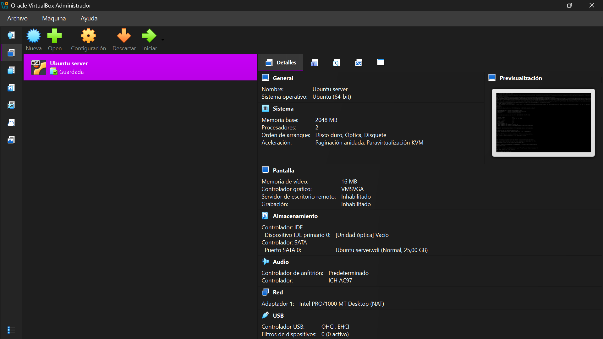

<em>Figura 1. Interfaz gráfica de usuario principal</em>

> Es la interfaz gráfica de usuario (GUI) principal basada en el kit de
> herramientas Qt. Es el componente más accesible para usuarios noveles,
> permitiendo crear, configurar y gestionar máquinas virtuales de forma
> visual. A través del Manager, se pueden configurar aspectos
> fundamentales como la memoria RAM, el número de CPUs y el
> almacenamiento virtual. Aunque es la herramienta más sencilla, no
> incluye todas las funciones avanzadas que ofrece el motor de
> VirtualBox

#### **2.2.3 VBoxManage**

> Es la interfaz de línea de comandos (CLI) de VirtualBox. A diferencia
> del Manager, VBoxManage da acceso a todas las funciones del motor de
> virtualización, incluyendo configuraciones avanzadas y experimentales
> que no están presentes en la interfaz gráfica. Es una herramienta
> esencial para la automatización y el scripting, permitiendo un control
> detallado de cada aspecto de la infraestructura virtual desde la
> terminal del sistema anfitrión

#### **2.2.4 Guest Additions**

> Son paquetes de software (drivers y aplicaciones de sistema) que se
> instalan dentro de la máquina virtual una vez que el sistema operativo
> invitado está en funcionamiento. Su objetivo es optimizar el
> rendimiento y mejorar la integración entre el host y el guest. Sus
> funciones principales incluyen:

- *Integración del puntero del ratón:* Evita tener que capturar
  manualmente el ratón, permitiendo un movimiento fluido entre ventanas.

- *Soporte de video mejorado:* Permite el cambio automático de
  resolución al redimensionar la ventana y aceleración 3D para
  aplicaciones.

- *Sincronización de tiempo:* Asegura que el reloj del huésped coincida
  con el del anfitrión.

#### **2.2.5 Extension Pack**

> Es un paquete opcional que añade funcionalidades avanzadas al paquete
> base de código abierto. Mientras que el paquete base es gratuito para
> cualquier uso, el Extension Pack requiere una licencia específica
> (PUEL) para uso comercial. Las capacidades que añade incluyen:

- Soporte para controladores USB 2.0 y USB 3.0 (xHCI).

> El soporte para estándares USB modernos permite que las máquinas
> virtuales (VM) interactúen con dispositivos físicos a velocidades de
> transferencia nativas.

- Tipos de controladores:

  - USB 1.1 (OHCI): Incluido en el paquete base, limitado a velocidades
    bajas.

  - USB 2.0 (EHCI): Soporta dispositivos de alta velocidad y habilita
    automáticamente la compatibilidad con el controlador OHCI.

  - USB 3.0 (xHCI): Es la opción más eficiente, soportando todas las
    velocidades hasta USB 3.0. Para invitados Windows antiguos (como
    Windows 7), es necesario instalar controladores de terceros dentro
    del sistema invitado.

- Filtros de dispositivos: Permiten automatizar la conexión de
  periféricos específicos a una VM basándose en criterios como el ID de
  vendedor (Vendor ID), ID de producto, fabricante o número de serie.

- Requisitos del Host:

  - En Windows, el instalador debe incluir el paquete de soporte USB que
    contiene drivers específicos para el anfitrión.

  - En Linux, el usuario que ejecuta VirtualBox debe pertenecer al grupo
    de sistema vboxusers para tener permisos de acceso al hardware USB.

  - En Oracle Solaris, se requiere la versión 11 FCS o posterior para el
    soporte completo.

<!-- -->

- VirtualBox Remote Desktop Protocol (VRDP): Permite controlar máquinas
  virtuales de forma remota utilizando clientes RDP estándar.

  - *Compatibilidad y Accesibilidad:* Al ser compatible con el estándar
    RDP, permite usar clientes tradicionales (como mstsc.exe en Windows
    o rdesktop en Linux) para controlar una VM. No requiere que el
    sistema operativo invitado tenga instalado un servidor RDP propio ni
    que posea un entorno gráfico activo (funciona incluso en modo
    texto).

  - *Capacidades Avanzadas:*

    - Acceso Remoto USB: Permite que un dispositivo USB conectado
      físicamente al cliente remoto aparezca en la máquina virtual como
      si estuviera conectado al host local.

    - Multiconexión: Soporta múltiples conexiones simultáneas donde
      todos los usuarios ven la misma pantalla y comparten el control
      del ratón y teclado, ideal para tareas de soporte colaborativo.

    - VBoxHeadless: Facilita la ejecución de VMs en servidores sin
      monitor, entregando la salida de video y el control exclusivamente
      a través de VRDP.

  - *Seguridad y Autenticación:*

    - Cifrado: Utiliza TLS (Transport Layer Security) para proteger el
      flujo de datos.

    - Métodos de autenticación: Puede configurarse para validar usuarios
      contra las cuentas del sistema anfitrión (mediante WinLogon o
      PAM), usar una biblioteca de contraseñas simple o, en modo
      inseguro, no requerir autenticación.

  - *Configuración de red:* El puerto predeterminado es el 3389, pero
    puede modificarse individualmente para cada VM para evitar
    conflictos en el host.

- Cifrado de imágenes de disco:

> Este mecanismo permite proteger la información sensible almacenada en
> los discos virtuales de forma transparente para el sistema invitado.

- *Algoritmo y Claves:* Utiliza el estándar AES (Advanced Encryption
  Standard) en modo XTS. Permite emplear claves de cifrado de datos
  (DEK) de 128 o 256 bits.

- *Gestión de la DEK:* La clave de cifrado (DEK) se almacena cifrada
  dentro del archivo de configuración .vbox de la máquina virtual y se
  descifra durante el arranque mediante la contraseña que se elija. Es
  vital no perder esta contraseña, ya que sin la DEK los datos se
  pierden de forma irremediable.

- Seguridad en ejecución: Mientras la VM está corriendo, la DEK se
  mantiene en la memoria del anfitrión para poder cifrar y descifrar los
  datos sobre la marcha.

> Las máquinas virtuales cifradas no se pueden exportar en formato OVF
> manteniendo el cifrado, por lo que el sistema las descifra
> automáticamente durante la exportación.

- Passthrough de webcam: Permite que la máquina virtual utilice la
  cámara web física del anfitrión. esta característica permite que el
  sistema operativo invitado acceda y utilice la cámara web física
  conectada al anfitrión como si fuera un dispositivo local.

  - Requisito de Software: A diferencia del cifrado, esta función sigue
    siendo parte del Oracle VM VirtualBox Extension Pack, el cual debe
    instalarse por separado.

  - Control de Rendimiento: A través de la línea de comandos
    (VBoxManage), se pueden configurar parámetros como MaxFramerate para
    limitar los cuadros por segundo y así reducir la carga de la CPU en
    el anfitrión.

  - Comportamiento por Sistema Operativo:

    - Windows: La webcam se desconecta automáticamente del invitado
      cuando se retira físicamente del anfitrión.

    - macOS: El dispositivo permanece \"conectado\" virtualmente aunque
      se retire del host y debe liberarse manualmente mediante comandos.

    - Linux y Solaris: Debido a limitaciones técnicas de sus APIs de
      video, la transmisión suele estar restringida a una resolución de
      640x480 a 20 FPS.

  - Gestión: Se puede activar o desactivar fácilmente desde el menú
    \"Dispositivos\" (Devices) de la ventana de la VM mientras esta está
    en ejecución.

### **2.3 Mecanismos**

#### **2.3.1 Virtualización asistida (Intel VT-x / AMD-V)**

> VirtualBox aprovecha las extensiones de hardware de los procesadores
> modernos para mejorar el rendimiento y la seguridad de las máquinas
> virtuales.

- *Extensiones compatibles:* Soporta Intel VT-x y AMD-V. Estas
  tecnologías permiten al hipervisor tomar el control de los recursos de
  hardware de manera global hasta que la última VM que los requiera sea
  apagada.

- *Requisito para 64 bits:* El uso de estas extensiones es obligatorio
  para ejecutar sistemas operativos invitados de 64 bits.

- *Virtualización por software:* A diferencia de otros productos,
  VirtualBox permite ejecutar sistemas invitados de 32 bits
  (arquitectura x86) mediante virtualización por software, lo que le
  permite funcionar en procesadores antiguos sin soporte de hardware.

- *Virtualización anidada:* Permite el paso de funciones de
  virtualización de hardware a la VM invitada, posibilitando la
  instalación de otros hipervisores (como KVM o el propio VirtualBox)
  dentro de una máquina virtual

#### **2.3.2 Virtualización de CPU, memoria, red y disco**

> VirtualBox emula un entorno de hardware completo para que el sistema
> invitado funcione de manera independiente.

- *CPU:* Soporta multiprocesamiento simétrico (SMP), permitiendo asignar
  hasta 32 CPUs virtuales por máquina. Además, permite establecer un
  límite de ejecución (CPU execution cap) para restringir cuánto tiempo
  de la CPU física consume una máquina virtual.

- *Memoria:* Utiliza técnicas como Nested Paging (EPT en Intel y RVI en
  AMD) para acelerar la traducción de direcciones de memoria entre el
  invitado y el anfitrión. También incluye mecanismos avanzados como
  Memory Ballooning (liberación dinámica de RAM para otros procesos) y
  Page Fusion (deduplicación de páginas de memoria idénticas entre VMs).

- *Red:* VirtualBox provee hasta ocho tarjetas de red virtual por VM.
  Ofrece múltiples modos como NAT (por defecto), Adaptador Puente
  (Bridged), Red Interna, Adaptador Solo-Anfitrión y Red en la Nube.
  Emula hardware común como adaptadores AMD PCNet e Intel PRO/1000.

- Disco: Las máquinas virtuales utilizan archivos de imagen en formatos
  como VDI (nativo), VMDK (VMware) o VHD (Microsoft). Estos discos
  pueden ser de tamaño fijo o de almacenamiento dinámico, donde el
  archivo crece conforme se escriben datos. Soporta controladores IDE,
  SATA (AHCI), SCSI, SAS y NVMe.

#### **2.3.3 Snapshot**

> Este mecanismo permite capturar el estado de una máquina virtual en un
> momento específico para poder revertir a él posteriormente.

- *Contenido:* Una instantánea guarda la configuración de la VM (en
  formato XML), el estado completo de todos los discos virtuales y, si
  la máquina está encendida, su estado de memoria RAM.

- *Funcionamiento técnico:* Al tomar una instantánea, VirtualBox
  \"congela\" el archivo de imagen de disco original y crea una imagen
  de diferenciación (differencing image) donde se grabarán todos los
  cambios nuevos.

- *Operaciones:* Es posible crear árboles complejos de instantáneas,
  permitiendo navegar entre diferentes estados históricos o
  configuraciones alternativas de una misma máquina. Al eliminar una
  instantánea, los datos deben \"fusionarse\" (merging) entre los
  archivos de diferenciación y sus padres.

#### **2.3.4 Controladores paravirtualizados**

> La paravirtualización expone interfaces de software especiales que
> permiten al sistema operativo invitado comunicarse de manera más
> eficiente con el hipervisor.
>
> VirtualBox puede exponer interfaces de tipo KVM (recomendado para
> Linux), Hyper-V (recomendado para Windows 7 y posteriores) o una
> interfaz mínima necesaria para sistemas Mac OS X.
>
> Incluye soporte para controladores de la industria como virtio-net y
> virtio-scsi (experimental). Estos controladores evitan la complejidad
> de emular hardware físico real, reduciendo la sobrecarga de
> procesamiento y mejorando significativamente el rendimiento de las
> operaciones de entrada/salida (I/O).

## **3. Características y capacidades**

### **3.1 Soporte de SO**

Oracle VirtualBox destaca por su amplia compatibilidad tanto en
plataformas anfitrionas (Host) como invitadas (Guest):

- *Sistemas Anfitriones (Host):* Se puede instalar en una gran variedad
  de sistemas de 64 bits, incluyendo Windows (desde Windows 10 hasta
  Windows Server 2025), macOS (en hardware Intel y Apple Silicon),
  múltiples distribuciones de Linux (Oracle Linux, Ubuntu, Debian,
  Fedora, openSUSE) y Oracle Solaris 11.4.

- *Sistemas Invitados (Guest):* Teóricamente, puede ejecutar cualquier
  sistema operativo x86, desde los más antiguos como DOS, Windows 3.x,
  98, NT, 2000, XP hasta los más modernos como Windows 11 y Windows
  Server 2025. También soporta una extensa lista de distribuciones de
  Linux (núcleos 2.4 y superiores), Solaris, FreeBSD, OpenBSD, OS/2, e
  incluso sistemas menos comunes como BeOS R5, Haiku y ReactOS.

- *Arquitecturas Arm:* Las versiones más recientes han introducido
  soporte experimental para ejecutar Windows 11 en anfitriones Arm y
  permiten la ejecución de invitados Arm en anfitriones con Apple
  Silicon (macOS).

### **3.2 Configuración básica de una VM** 

Internamente, VirtualBox trata a cada máquina virtual como un conjunto
de parámetros que definen su comportamiento y estado.

#### **3.2.1 General**

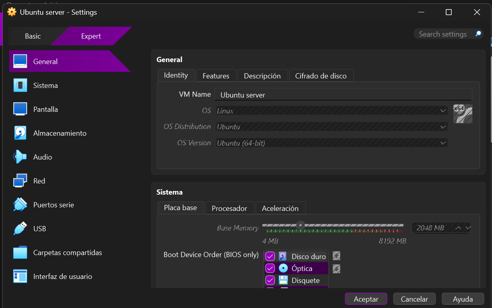

<em>Figura 2. Sección “General” del panel de configuración</em>

> Esta sección abarca la identidad y funciones de integración básica:

- *Identidad:* Incluye el nombre de la VM (utilizado para guardar los
  archivos de configuración en el host) y el tipo/versión del sistema
  operativo, lo que permite a VirtualBox sugerir configuraciones
  óptimas.

- *Funciones avanzadas:* Permite configurar la ubicación de la carpeta
  de instantáneas (snapshots), activar el Portapapeles compartido
  (deshabilitado por defecto) y la función de Arrastrar y Soltar (Drag
  and Drop) en varios modos (unidireccional o bidireccional). Estas
  funciones requieren la instalación de las Guest Additions en el
  invitado.

- *Cifrado de disco:* Permite proteger los datos de la VM mediante
  algoritmos AES (128 o 256 bits), cifrando el contenido de las imágenes
  de disco para evitar accesos no autorizados si los archivos son
  copiados o movidos.

#### **3.2.2 Sistema (CPU, RAM, Aceleración)**

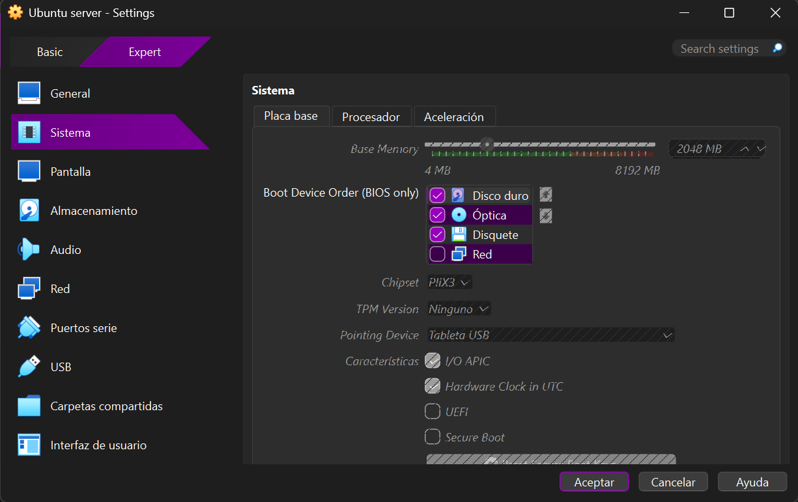

<em>Figura 3. Sección de “Sistema” del panel de configuración</em>

> Define los recursos de hardware críticos asignados:

- *Memoria RAM (Base Memory):* Cantidad de memoria física del anfitrión
  que se reserva exclusivamente para la VM mientras está en ejecución.

- *CPU:* Soporta multiprocesamiento simétrico (SMP), permitiendo asignar
  hasta 32 CPUs virtuales por VM, independientemente de los núcleos
  físicos del host. Incluye un Límite de ejecución (Processing Cap) para
  restringir el tiempo que un hilo de la CPU del host dedica a emular la
  CPU virtual. También permite activar PAE/NX para invitados de 32 bits
  que necesiten direccionar más de 4 GB de RAM.

- *Aceleración:* Permite seleccionar la interfaz de paravirtualización
  (KVM para Linux, Hyper-V para Windows o Minimal para macOS) para
  mejorar la precisión del tiempo y el rendimiento. Además, utiliza
  Nested Paging (EPT en Intel o RVI en AMD) para acelerar la gestión de
  memoria por hardware.

#### **3.2.3 Almacenamiento**

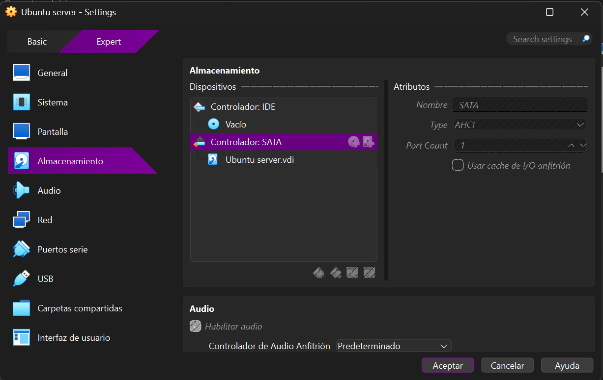

<em>Figura 4.  Sección  de “Almacenamiento” del panel de configuración</em>

> VirtualBox presenta controladores de almacenamiento virtuales que se
> conectan a archivos de imagen en el host:

- *Controladores:* Emula IDE (común para unidades ópticas), SATA/AHCI
  (estándar moderno para discos rígidos), SCSI, SAS, NVMe (para alto
  rendimiento en SSDs) y controladores de Disquete.

- *Formatos de imagen:* Soporta VDI (nativo), VMDK (VMware), VHD
  (Microsoft) y HDD (Parallels v2).

- *Modos de escritura:* Los discos pueden ser de tamaño fijo o de
  almacenamiento dinámico (crecen según se llenan). Existen modos
  especiales como Inmutable (los cambios se pierden al reiniciar) o
  Write-through (los cambios no se ven afectados por las instantáneas).

#### **3.2.4 Pantalla**

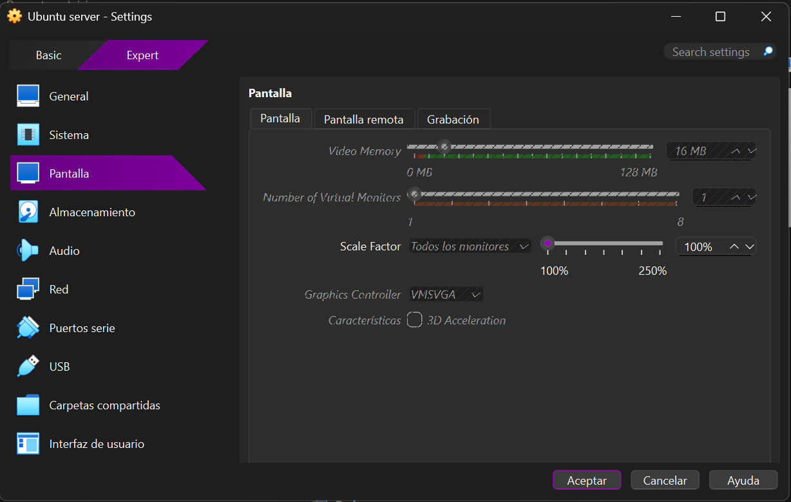

<em>Figura 5. Sección de “Pantalla” del panel del configuraciónl</em>

- *Memoria de vídeo:* RAM asignada a la tarjeta gráfica virtual que
  determina la resolución y profundidad de color máximas.

- *Monitores:* Soporte para hasta ocho monitores virtuales
  independientes.

> En el modo de ventana normal, cada monitor adicional aparece como una
> ventana independiente en el escritorio del anfitrión, pudiendo
> ejecutarse una al lado de la otra.
>
> En los modos de pantalla completa o fluido (seamless), los monitores
> virtuales se mapean directamente a los monitores físicos conectados al
> sistema anfitrión. Para que esto funcione correctamente, el anfitrión
> debe tener al menos tantos monitores físicos como monitores virtuales
> se hayan configurado, de lo contrario el software reportará un error.
>
> La topología de los monitores (resolución y estado
> habilitado/deshabilitado) puede controlarse mediante el menú \"Ver\",
> redimensionando las ventanas o usando el comando VBoxManage controlvm
> setscreenlayout.

- *Controlador Gráfico:*

> El controlador gráfico define el tipo de adaptador que el sistema
> operativo invitado \"verá\" instalado. La selección adecuada es
> crítica para la estabilidad y el rendimiento.
>
> VBoxSVGA: Es el controlador predeterminado y recomendado para máquinas
> virtuales que utilizan Windows 7 o versiones posteriores. Ofrece un
> rendimiento optimizado y es el único con soporte robusto para
> aceleración 3D en Windows moderno.
>
> VMSVGA: Utilizado para emular un dispositivo gráfico VMware SVGA. Es
> el controlador estándar y recomendado para invitados Linux.
>
> VBoxVGA: Destinado a sistemas operativos invitados legados (como
> versiones de Windows anteriores a 7 u Oracle Solaris). Este
> controlador no es compatible con la aceleración 3D.
>
> Tener en cuenta que para utilizar los controladores VBoxSVGA o VMSVGA,
> es obligatorio tener instaladas las Guest Additions en el sistema
> invitado

- *Aceleración 3D:* Permite a las aplicaciones del invitado usar el
  hardware gráfico del anfitrión a través de OpenGL o Direct3D,
  mejorando significativamente el rendimiento visual.

- *Captura y Grabación:* Permite grabar la sesión de la VM (video y
  audio) directamente en archivos formato WebM/VP8.

#### **3.2.5 USB y dispositivos**

- USB: 
  

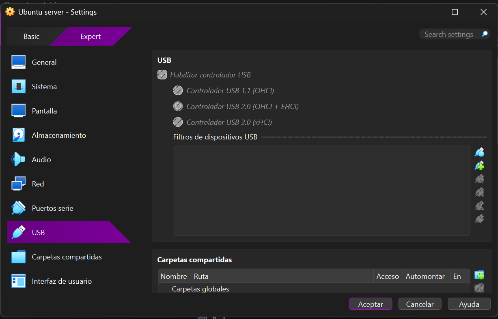

<em>Figura 6. Sección “USB” del panel de configuración</em>

  Emula controladores USB 1.1 (OHCI), 2.0 (EHCI) y 3.0 (xHCI).
  Permite la conexión directa de dispositivos físicos del host al
  invitado mediante filtros de dispositivos (basados en ID de vendedor,
  producto o número de serie).

- Audio: 
  

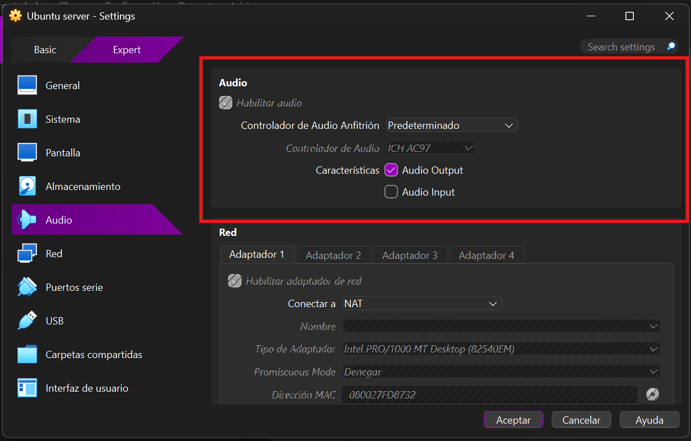

<em>Figura 7. Sección “Audio” del panel de configuración</em>

  Emulación de tarjetas Intel AC\'97, Intel HD Audio o
  SoundBlaster 16, con capacidad de capturar entrada y salida del
  sistema anfitrión.

- Puertos Serie: 
  

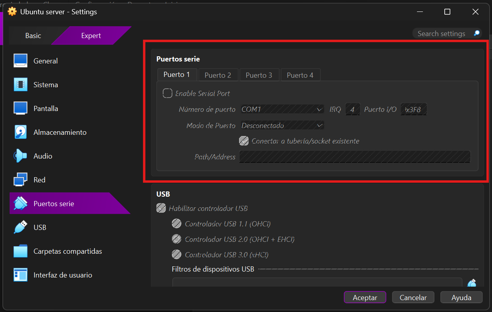

<em>Figura 8. Sección “Puerto serie” del panel de configuración</em>

  Soporta hasta cuatro puertos serie virtuales, que
  pueden redirigirse a puertos físicos del host, archivos raw, tuberías
  (pipes) o sockets TCP.

- Carpetas Compartidas: 
  

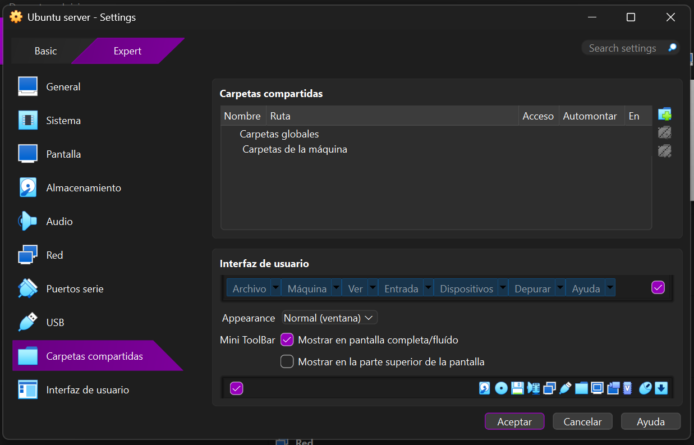

<em>Figura 9. Sección “Carpetas compartidas” del panel de configuración</em>

  Facilitan el intercambio de archivos entre host
  y guest sin necesidad de configurar una red real, funcionando como una
  unidad de red virtual.

### **3.3 Configuración avanzada de una VM**

#### **3.3.1 Adaptadores virtuales (NIC)**

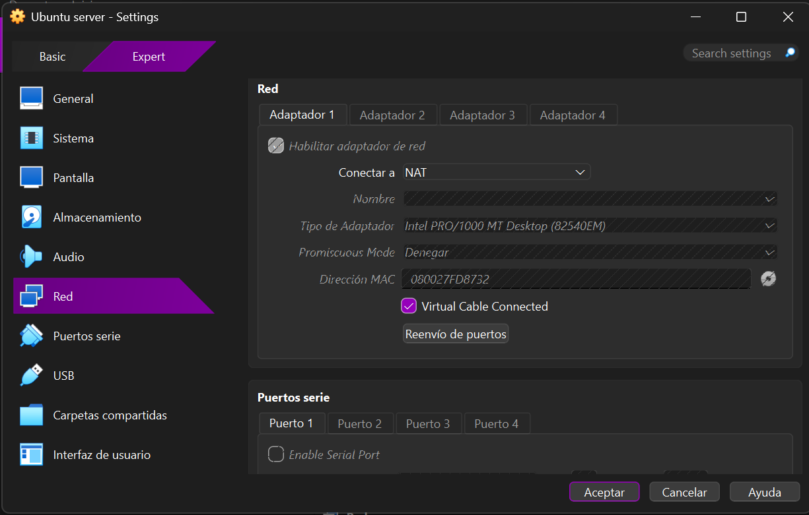

<em>Figura 10. Pestaña de “Adaptador 1” de la sección de “Red”</em>

> Oracle VirtualBox tiene la capacidad de proporcionar hasta ocho
> tarjetas de red PCI Ethernet virtuales para cada máquina virtual.
> Mientras que las primeras cuatro pueden configurarse detalladamente a
> través de la interfaz gráfica (VirtualBox Manager), las ocho tarjetas
> completas están disponibles para su gestión mediante la interfaz de
> línea de comandos VBoxManage.
>
> Tipos de Hardware Virtualizado
>
> Para cada tarjeta, el usuario puede seleccionar qué tipo de hardware
> físico se presentará al sistema operativo invitado:

- *AMD PCNet FAST III (Am79C973):* Es el valor predeterminado para la
  mayoría de los invitados x86, ya que cuenta con un soporte casi
  universal en sistemas operativos y cargadores de arranque como GNU
  GRUB.

- *Familia Intel PRO/1000 (MT Desktop, T Server, MT Server):* Estos
  adaptadores son la elección recomendada para sistemas modernos como
  Windows Vista y posteriores, que ya no incluyen controladores nativos
  para las tarjetas AMD PCNet.

- *Adaptador de red paravirtualizado (virtio-net):* Es un adaptador
  especial que no emula hardware común, sino que espera una interfaz de
  software específica proporcionada por el invitado. Es la opción
  preferida para obtener el máximo rendimiento, ya que evita la
  complejidad de la emulación de hardware y soporta funciones como la
  descarga de segmentación y suma de comprobación (offloading).

- *Ethernet sobre USB (usbnet):* Permite la emulación de un adaptador de
  red conectado a través del bus USB.

#### **3.3.2 Modos de red**

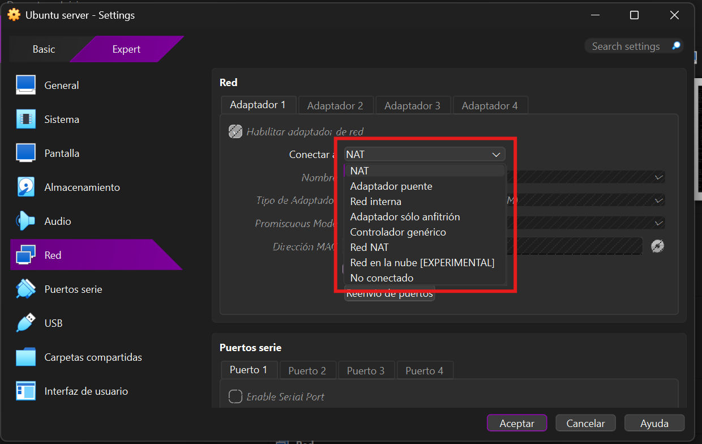

<em>Figura 11. Sección para seleccionar el tipo de red</em>

##### **3.3.2.1 NAT**

> Es el modo por defecto cuando se crea una máquina virtual nueva.

- *Funcionamiento:* La VM actúa como un ordenador detrás de un router
  (el motor de red de VirtualBox), que mapea el tráfico de forma
  transparente.

- *Visibilidad:* La máquina virtual es invisible e inalcanzable desde el
  exterior de forma directa, lo que maximiza la seguridad al aislar a
  los invitados entre sí y del exterior.

- *Configuración:* No requiere configuración en la red del anfitrión.
  Por defecto, asigna a la VM una dirección en el rango 10.0.2.x.

- *Interacción con el Host:* El invitado puede acceder a servicios en la
  interfaz de loopback del anfitrión a través de la dirección IP
  10.0.2.2.

- *Reenvío de puertos:* Para que un servicio en la VM sea accesible
  desde el exterior, se deben configurar reglas de reenvío de puertos
  (port forwarding), permitiendo que VirtualBox escuche puertos
  específicos en el host y redirija los paquetes al invitado.

##### **3.3.2.2 NAT Network**

> Este servicio funciona de forma similar a un router doméstico,
> agrupando sistemas en una red privada.

- *Diferencia con NAT:* A diferencia del modo NAT simple, permite que
  las máquinas virtuales conectadas a la misma \"Red NAT\" se comuniquen
  entre sí mediante TCP/IP.

- *Requisito previo:* Primero se debe crear el servicio de Red NAT en
  las preferencias globales de VirtualBox antes de poder seleccionarlo
  en la configuración de la VM.

- *Capacidades:* Soporta servidores DHCP para la asignación automática
  de IPs internas y permite configurar el reenvío de puertos para toda
  la red.

##### **3.3.2.3 Adaptador puente (Bridged)**

> Este modo es para necesidades avanzadas como simulaciones de red o
> ejecución de servidores en el invitado.

- *Funcionamiento:* VirtualBox utiliza un controlador de filtro en el
  anfitrión para interceptar e inyectar datos directamente en la tarjeta
  de red física.

- *Identidad en la red:* El invitado aparece como un dispositivo físico
  independiente más en la red local, obteniendo su propia dirección IP
  del router físico o servidor DHCP de la red real.

- *Conectividad inalámbrica:* En redes Wi-Fi, VirtualBox debe reemplazar
  la dirección MAC de origen en los paquetes salientes para que la
  respuesta sea enviada correctamente a la interfaz del host, ya que la
  mayoría de adaptadores inalámbricos no soportan el modo promiscuo.

##### **3.3.2.4 Red interna**

> Crea una red de software que es visible únicamente para las máquinas
> virtuales seleccionadas en el mismo anfitrión.

- *Aislamiento total:* No es visible para las aplicaciones que se
  ejecutan en el sistema anfitrión ni para el mundo exterior.

- *Seguridad:* Es más segura que el modo puente para comunicaciones
  privadas entre VMs, ya que el tráfico no pasa por la interfaz física
  del host y, por tanto, no puede ser capturado por un analizador de
  paquetes (sniffer) en el anfitrión.

- *Gestión:* VirtualBox actúa automáticamente como un conmutador
  (switch) de red para todas las tarjetas que comparten el mismo nombre
  de red interna.

##### **3.3.2.5 Host-Only**

> Se considera un híbrido entre los modos puente e interna.

- *Interfaz virtual:* VirtualBox crea una interfaz de red de software en
  el anfitrión (similar a una interfaz de loopback) que proporciona
  conectividad entre las máquinas virtuales y el anfitrión.

- *Limitaciones:* Las máquinas virtuales pueden hablar entre sí y con el
  host, pero no pueden acceder a la red física externa ni a internet.

- *Uso común:* Es ideal para entornos de desarrollo con múltiples capas;
  por ejemplo, un servidor web en una VM y una base de datos en otra VM,
  permitiendo que se comuniquen de forma privada mientras el host
  administra ambos sistemas.

- *Servicios integrados:* Incluye un servidor DHCP predeterminado que
  gestiona las direcciones IP dentro de esta red virtual para evitar
  configuraciones estáticas manuales.

#### **3.3.3 Modo promiscuo**

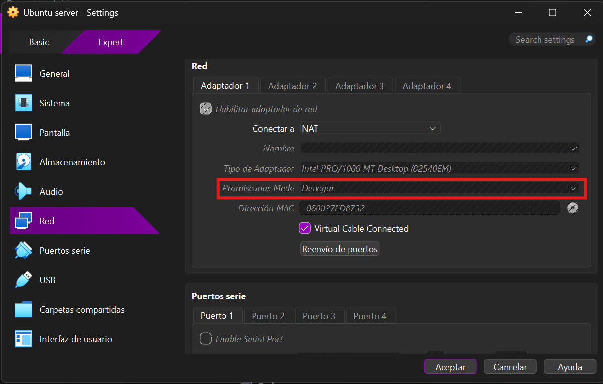

<em>Figura 12. Apartado para seleccionar el modo de promiscuidad</em>

> El modo promiscuo es una configuración que permite a una tarjeta de
> red virtual recibir y procesar todo el tráfico que circula por la red,
> incluso si no está destinado a su propia dirección MAC.

- *Políticas disponibles:* VirtualBox ofrece tres niveles de filtrado
  para este modo:

  - Deny (Denegar): Es el valor por defecto y oculta cualquier tráfico
    que no esté específicamente dirigido al adaptador de red de la
    máquina virtual.

  - Allow-VMs (Permitir VMs): Oculta todo el tráfico generado por el
    anfitrión, pero permite a la máquina virtual ver el tráfico hacia y
    desde otras VMs.

  - Allow-all (Permitir todo): Elimina todas las restricciones,
    permitiendo que el adaptador virtual vea todo el tráfico de la red.

- *Compatibilidad y usos:* Este modo es fundamental para realizar
  análisis de tráfico detallados con herramientas como Wireshark. Se
  puede habilitar en los modos de red como NAT Network, Adaptador Puente
  o Red Interna.

#### **3.3.4 Dirección MAC**

> La dirección MAC es el identificador físico único que Oracle
> VirtualBox asigna a cada tarjeta de red virtual instalada en una
> máquina virtual.

- *Asignación inicial:* Por defecto, VirtualBox asigna una dirección MAC
  aleatoria al momento de crear la máquina virtual.

- *Políticas de clonación e importación:* Al clonar o importar una VM,
  el sistema permite decidir si se deben generar nuevas direcciones MAC
  para todos los adaptadores o si se deben preservar las originales.
  Generar nuevas direcciones es la opción recomendada para evitar
  colisiones si ambas máquinas operan en la misma red.

- *Comportamiento en redes inalámbricas:* En el modo de Adaptador Puente
  con interfaces Wi-Fi, VirtualBox debe reemplazar la dirección MAC de
  origen del invitado con la del adaptador inalámbrico del anfitrión, ya
  que la mayoría de estas tarjetas no soportan el modo promiscuo y el
  tráfico debe salir con la identidad del host para recibir respuesta.

#### **3.3.5 Port Forwarding**

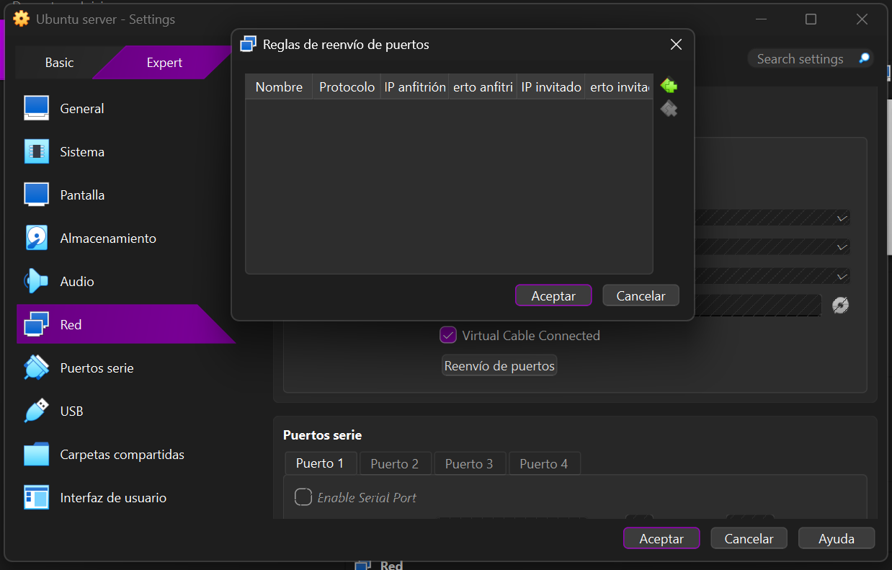

<em>Figura 13. Ventana para definir las reglas de reenvío de puertos</em>

> Debido a que el modo NAT aísla a la máquina virtual en una red privada
> invisible desde el exterior, el reenvío de puertos es el mecanismo
> necesario para hacer que los servicios del invitado sean accesibles.
>
> Funcionamiento técnico: VirtualBox escucha en un puerto específico del
> sistema anfitrión y redirige automáticamente todos los paquetes que
> llegan allí hacia un puerto determinado dentro de la máquina virtual.
>
> Configuración de reglas: Cada regla requiere definir un nombre
> descriptivo, el protocolo (TCP o UDP), la IP y puerto del anfitrión, y
> la IP y puerto del invitado. Si el invitado usa DHCP, la IP del
> invitado puede omitirse en la regla.
>
> Restricciones de seguridad: En sistemas anfitriones basados en UNIX
> (Linux, macOS, Solaris), no es posible vincular reglas a puertos del
> host inferiores al 1024 si VirtualBox no es ejecutado por el usuario
> root; de intentarse, la máquina virtual no arrancará.
>
> Ventajas: Este método permite ejecutar servidores (como SSH o
> servidores web) de forma segura, ya que el servicio está aislado en el
> sistema invitado y no puede comprometer directamente al anfitrión si
> existe una vulnerabilidad.

### **3.4 Funcionalidades Avanzadas**

#### **3.4.1 Clones**

> Un clon es una copia completa o vinculada de una máquina virtual
> existente, utilizada para experimentar con configuraciones o realizar
> respaldos sin alterar la VM original,.

- *Tipos de clonación:*

  - Clon completo: Copia todos los archivos de imagen del disco; el
    nuevo clon es totalmente independiente del original.

  - Clon vinculado: Crea nuevas imágenes de diferenciación basadas en
    las del original, lo que ahorra espacio en disco pero requiere que
    la VM fuente permanezca accesible.

- *Modos de operación:* Se puede clonar solo el estado actual (sin
  instantáneas), una rama específica (estado actual y sus hijos) o todo
  (incluyendo el árbol completo de instantáneas).

- *Políticas de red:* Al clonar, VirtualBox permite decidir si se deben
  generar nuevas direcciones MAC para los adaptadores de red, evitando
  colisiones si ambas máquinas operan en la misma red.

#### **3.4.2 Shared Folders**

> Permiten el intercambio de archivos entre el host y el guest sin
> necesidad de configurar una red real,.

- Requisito crítico: Es obligatorio tener instaladas las Guest Additions
  en el sistema invitado.

- Tipos de compartición:

  - Permanentes: Se guardan en la configuración de la VM.

  - Transitorias: Se añaden en caliente y desaparecen al apagar la VM.

  - Globales: Disponibles para todas las máquinas virtuales del
    anfitrión,.

- Montaje automático: Si se activa, el invitado verá la carpeta
  automáticamente (ej. como una unidad de red en Windows o bajo
  /media/sf_nombre en Linux).

#### **3.4.3 Portapapeles compartido**

> Esta función permite copiar texto, imágenes y contenido HTML entre el
> host y la VM, tratándolos como aplicaciones locales.

- *Direccionalidad:* Puede configurarse como Inhabilitado, Anfitrión a
  Invitado, Invitado a Anfitrión o Bidireccional,.

- *Seguridad:* Por defecto está inhabilitado para proteger datos
  sensibles del anfitrión ante posibles accesos desde el invitado,.

- *Transferencia de archivos:* En versiones recientes, también permite
  transferir archivos físicos a través de la función de copiar/pegar,.

#### **3.4.4 Drag & Drop entre host y guest**

> Facilita la transferencia transparente de archivos y directorios
> arrastrándolos físicamente de una ventana a otra.

- Funcionalidad: Actualmente solo soporta la copia de datos, no el
  movimiento ni el enlace de los mismos.

- Limitaciones técnicas: En hosts Windows, no funciona si hay
  diferencias en los niveles de elevación de privilegios (UAC) entre
  VirtualBox y el explorador de archivos. Además, requiere que las Guest
  Additions estén activas,.

- Modos: Al igual que el portapapeles, soporta flujos unidireccionales o
  bidireccionales,.

### **3.5 Licencias y soporte**

**Esquema de Licenciamiento**

VirtualBox no es un bloque único de software, sino que se distribuye en
dos paquetes con términos legales distintos:

- *VirtualBox Base Package:* Es de código abierto y se distribuye bajo
  la licencia GNU General Public License (GPL) versión 2. Es totalmente
  gratuito para uso personal, educativo y profesional.

- *VirtualBox Extension Pack:* Este paquete se distribuye bajo la
  Licencia de Evaluación y Uso Personal (PUEL). Es gratuito para uso
  personal, educativo o de evaluación, pero las empresas deben adquirir
  una licencia comercial perpetua para su implementación en entornos
  profesionales o corporativos.

**Niveles de Soporte de Oracle**

Oracle clasifica el soporte técnico según la compatibilidad y la
estabilidad del sistema operativo invitado (Guest):

- *Oracle Premier Support:* Se ofrece únicamente para una selección
  específica de sistemas operativos invitados y sus respectivas Guest
  Additions, como las versiones recientes de Windows (10, 11,
  Server 2025) y Oracle Linux. En anfitriones Arm64 (macOS), Windows 11
  solo tiene soporte Premier si se ejecuta en hardware de Apple.

- *Soporte Limitado:* Se aplica a otros sistemas operativos que pueden
  funcionar correctamente pero no garantizan la resolución de problemas
  técnicos por parte de Oracle.

- *Soporte Enterprise:* Las empresas que adquieren licencias comerciales
  obtienen soporte integral tanto para el paquete base como para el
  paquete de extensiones.

- *Características Experimentales:* Funcionalidades como el uso de
  VirtualBox en Windows 11 con procesadores Arm o el soporte para
  invitados macOS no están cubiertas por el soporte Premier.

## **4. Instalación y demostración práctica**

### **4.1. Requisitos del sistema** 

#### **4.1.1 Requisitos de hardware**

> Para ejecutar Oracle VirtualBox de forma correcta, el equipo debe
> cumplir con ciertos requisitos mínimos de hardware. En cuanto al
> procesador, se requiere una CPU de arquitectura x86_64 (64 bits); en
> el caso de procesadores Intel, estos deben contar con soporte para
> SSE2 (Streaming SIMD Extensions 2). Adicionalmente, para aprovechar la
> virtualización por hardware, es necesario que el procesador tenga
> habilitadas las extensiones Intel VT-x o AMD-V desde la BIOS/UEFI del
> sistema, ya que sin ellas el rendimiento de las máquinas virtuales se
> ve considerablemente reducido. También se recomienda contar con al
> menos 4 GB de RAM en el host, aunque la cantidad real dependerá de
> cuánta memoria se asigne a las máquinas virtuales que se ejecuten
> simultáneamente. En cuanto al almacenamiento, se necesita espacio
> suficiente tanto para la instalación del software como para los discos
> virtuales de cada máquina.

#### **4.1.2 Versión**

> La versión utilizada como referencia en este informe es la versión
> 7.1.6 , aunque en la página web esta la más reciente disponible al
> momento de su elaboración (v7.2.6), descargable directamente desde el
> sitio oficial virtualbox.org. Oracle mantiene un ciclo de
> actualizaciones activo, por lo que se recomienda siempre verificar la
> última versión estable antes de proceder con la instalación.

#### **4.1.3 Sistemas host soportados**

> VirtualBox puede instalarse en una amplia variedad de sistemas
> operativos anfitriones. En Windows, es compatible con Windows 10 y
> Windows 11 en procesadores x86_64, así como con Windows Server 2022 y
> 2025. También existe soporte experimental para Windows 11 en
> procesadores Arm. En macOS, soporta desde la versión 13 (Ventura)
> hasta la 26 (Tahoe), tanto en procesadores Intel como en Apple Silicon
> (Arm). En Linux, es compatible con distribuciones como Ubuntu (20.04,
> 22.04, 24.04 y 24.10), Debian 11 y 12, Fedora 40/41/42, openSUSE 15.6,
> Oracle Linux y Red Hat Enterprise Linux 8, 9 y 10, todas en
> arquitectura x86_64. Finalmente, también cuenta con soporte para
> Oracle Solaris 11.4.

### **4.2 Proceso de instalación en Windows**

La instalación de Oracle VirtualBox en Windows es un proceso sencillo
que se realiza a través de un asistente gráfico. A continuación se
describe cada etapa del proceso.

**Descarga del instalador**

El primer paso consiste en ingresar al sitio oficial virtualbox.org y
dirigirse a la sección de descargas. Allí, bajo el apartado \"VirtualBox
platform packages\", se debe seleccionar la opción Windows hosts, lo
cual iniciará la descarga de un archivo .exe. Se recomienda ejecutarlo
con permisos de administrador haciendo clic derecho sobre el archivo y
eligiendo \"Ejecutar como administrador\".

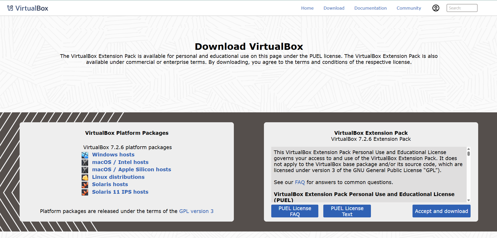

<em>Figura 14. Sitio oficial de Oracle VirtualBox-Sección de descargas</em>

**Pantalla de bienvenida y componentes**

Al ejecutar el instalador, aparece la pantalla de bienvenida del
asistente. Tras hacer clic en Next, se presenta la selección de
componentes a instalar. Por defecto están habilitados todos, y se
recomienda dejarlos así. Los componentes disponibles son los siguientes:
VirtualBox Application (binarios principales, obligatorio), USB Support
(para acceder a dispositivos USB desde la VM), Networking (incluye
soporte para redes Bridged y Host-Only), y Python Support (para
scripting con la API de VirtualBox, requiere Python 3 instalado
previamente).

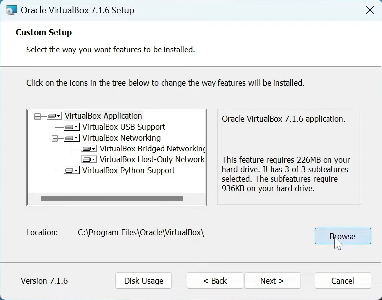

<em>Figura 15.Ventana de instalación de Oracle VirtualBox</em>

**Ruta de instalación**

El instalador propone por defecto la ruta **C:\\Program
Files\\Oracle\\VirtualBox.** Esta puede modificarse si el disco C tiene
espacio limitado. Se recomienda mantener la ruta predeterminada para
evitar posibles conflictos con permisos de directorio que el instalador
de Windows válida.

**Instalación y finalización**

Una vez confirmadas todas las opciones, el asistente muestra una
pantalla de resumen y al hacer clic en *Install* comienza la copia e
instalación de archivos. Durante este proceso, Windows puede mostrar una
o varias alertas de seguridad solicitando permiso para instalar
controladores de dispositivo (drivers de red y USB). En todos los casos
se debe hacer clic en *Instalar* o *Permitir*, ya que son componentes
esenciales de VirtualBox. Al finalizar, aparece la pantalla de
conclusión con la opción de iniciar VirtualBox inmediatamente.

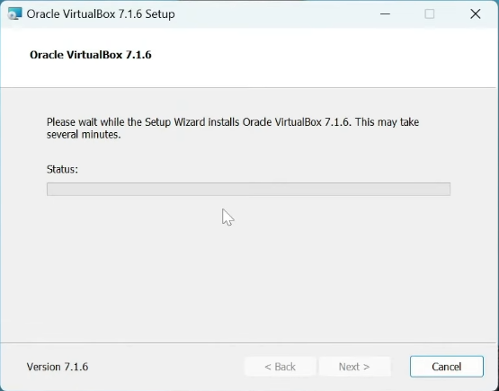{width="2.944721128608924in"
height="2.3177088801399823in"}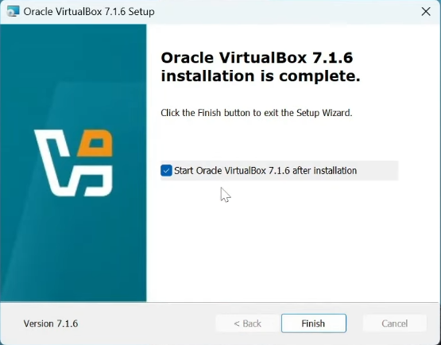{width="2.9973129921259845in"
height="2.3489588801399823in"}

<em>Figura 16.Ventana de instalación y finalización de Oracle VirtualBox</em>

**Consideración adicional: conflicto con Hyper-V**

Un aspecto importante a tener en cuenta en Windows es que si el sistema
tiene activada la característica Hyper-V de Microsoft (común en equipos
con Windows 10/11 Pro o Enterprise), puede generarse un conflicto que
afecte el rendimiento de las VMs en VirtualBox. En ese caso, es posible
desactivar Hyper-V desde PowerShell con el comando bcdedit /set
hypervisorlaunchtype off y reiniciar el equipo. Versiones recientes de
VirtualBox (7.x) han mejorado la compatibilidad con este escenario, pero
conviene tenerlo presente.

### **4.3 Proceso de instalación en Linux**

La instalación de VirtualBox en Linux varía ligeramente según la
distribución, pero en términos generales sigue dos enfoques: mediante el
gestor de paquetes del sistema usando el repositorio oficial de Oracle,
o descargando el paquete ***.deb / .rpm*** directamente desde el sitio
web. A continuación se describe el proceso para las distribuciones más
comunes basadas en **Debian/Ubuntu**, que son las más utilizadas en
entornos educativos.

**Dependencias previas**

Antes de instalar VirtualBox, es necesario asegurarse de que el sistema
cuenta con ciertos paquetes requeridos. El más importante es **dkms**
(Dynamic Kernel Module Support), que permite que los módulos del kernel
de VirtualBox se recompilen automáticamente cada vez que el kernel de
Linux se actualice, evitando que VirtualBox deje de funcionar tras una
actualización del sistema. Para instalarlo se ejecuta el siguiente
comando:

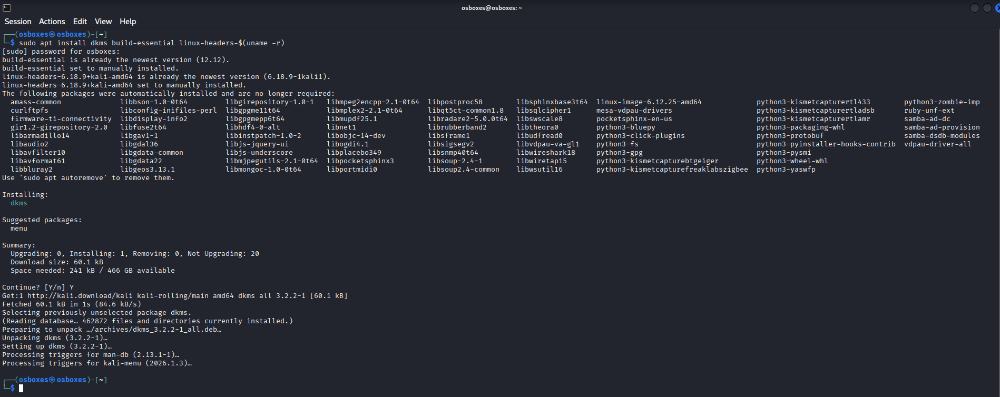

<em>Figura 17.Instalación del dkms</em>

**Método 1: Repositorio oficial de Oracle (recomendado)**

Este método es el más recomendado porque permite recibir actualizaciones
automáticas de VirtualBox junto con las actualizaciones del sistema. El
proceso consiste en tres pasos principales.

Primero, se agrega la clave GPG de Oracle para verificar la autenticidad
de los paquetes:

**curl -fsSL https://www.virtualbox.org/download/oracle_vbox_2016.asc \|
sudo gpg \--dearmor -o /usr/share/keyrings/oracle-virtualbox.gpg**

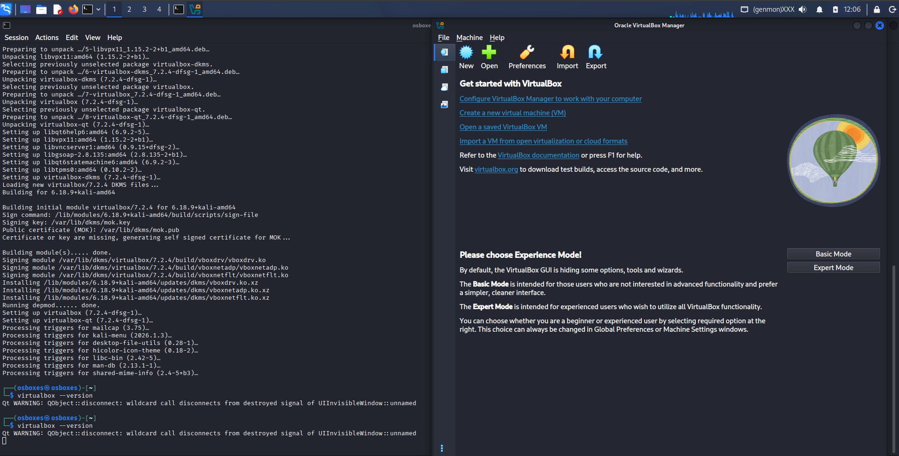

<em>Figura 18.Terminal mostrando el proceso de instalación de Oracle VirtualBox completado exitosamente
con apt.</em>

**Método 2: Paquete .deb descargado manualmente**

Si se prefiere no agregar un repositorio externo, se puede descargar el
paquete .deb directamente desde
[[virtualbox.org/wiki/Linux_Downloads]{.underline}](https://www.virtualbox.org/wiki/Linux_Downloads),
seleccionando la distribución correspondiente. Una vez descargado, se
instala con:

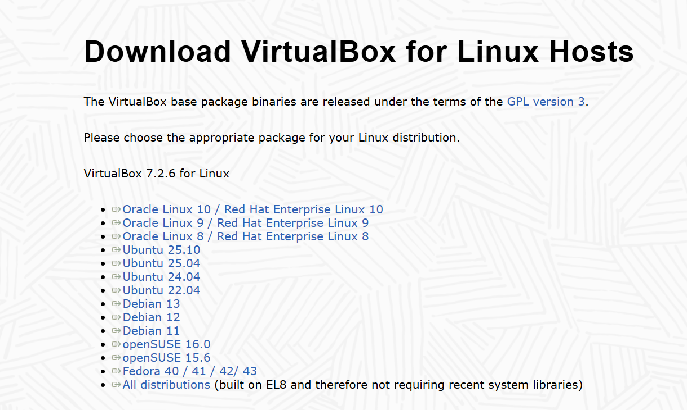

<em>Figura 19.Descarga w Instalación desde la pagina oficial de virtualbox /em>

Una vez descargado se instala con **sudo dpkg -i
virtualbox-7.1\_\*.deb**

**Verificación de la instalación**

Una vez completada la instalación, se puede verificar que VirtualBox
quedó correctamente instalado ejecutando:

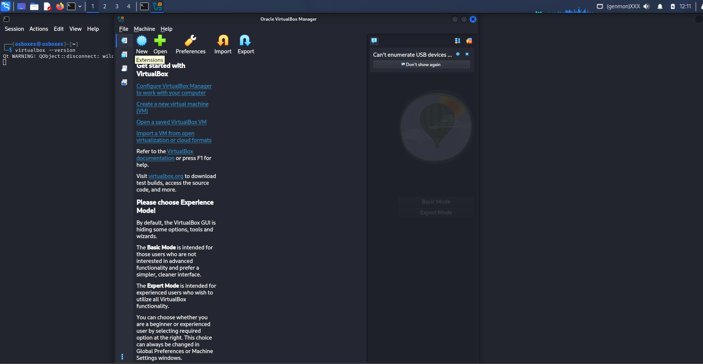

<em>Figura 20.Verificacion desde consola de la instalación de Oracle VirtualBox /em>

### **4.4 Demostración: Creación de una VM paso a paso**

Una vez instalado VirtualBox, el siguiente paso es crear una máquina
virtual. VirtualBox ofrece dos modos para hacerlo: el **modo guiado** y
el **modo experto**. Ambos permiten configurar los mismos parámetros,
pero difieren en la forma en que se presentan al usuario.

**Inicio del proceso**

Para crear una nueva máquina virtual se hace clic en el botón
**\"Nueva\"** (o *New*) ubicado en la barra de herramientas principal
del VirtualBox Manager. Inmediatamente aparece el asistente de creación,
donde comienza la configuración.

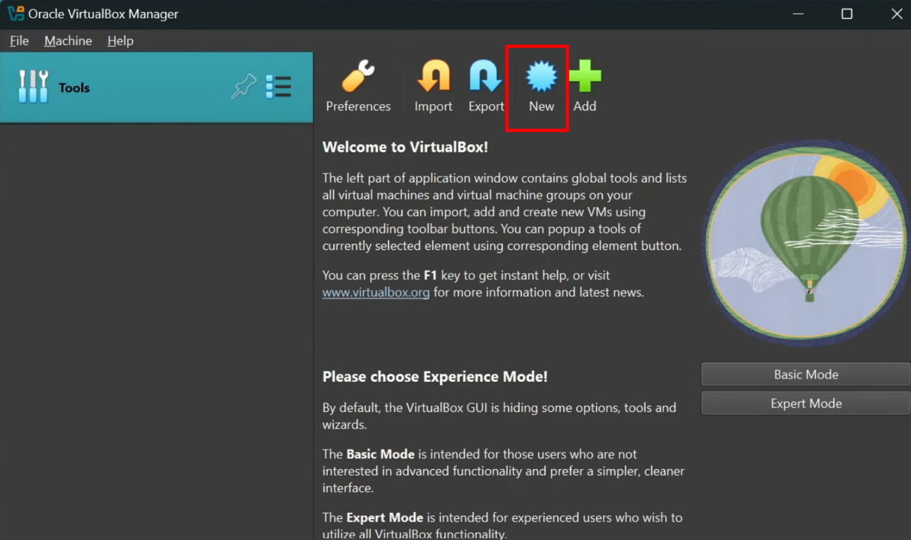

<em>Figura 21.Boton para crear una nueva VM en VirtualBox /em>

#### **4.4.1 Modo guiado vs Modo experto**

> **Modo guiado**
>
> El modo guiado presenta la configuración dividida en varias pantallas
> secuenciales, lo que lo hace ideal para usuarios que se están
> familiarizando con la herramienta. Cada pantalla solicita un grupo
> específico de parámetros y el asistente guía al usuario de forma
> lógica de un paso al siguiente.
>
> La secuencia de pantallas es la siguiente:
>
> **Paso 1 --- Nombre y sistema operativo:** Se asigna un nombre a la
> máquina virtual, se selecciona la carpeta donde se almacenará, y se
> elige el ISO del tipo de sistema operativo (por ejemplo, Linux,
> Windows, macOS) junto con la versión específica (Ubuntu 24.04, Windows
> 11, etc.). VirtualBox ajusta automáticamente algunos parámetros
> recomendados según el sistema operativo elegido.
>

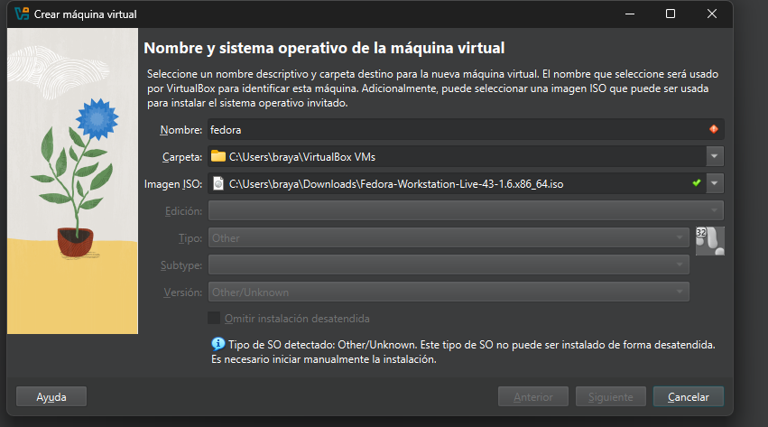

<em>Figura 22.Interfaz grafica para agregar el nombre y S.O de la VM /em>

>
> **Paso 2 --- Hardware:** Se define la cantidad de memoria RAM que se
> asignará a la VM y el número de procesadores virtuales (vCPUs).
> VirtualBox indica con una barra de color el rango seguro de asignación
> para no comprometer el rendimiento del host. Se recomienda no superar
> la zona verde de dicha barra.
>

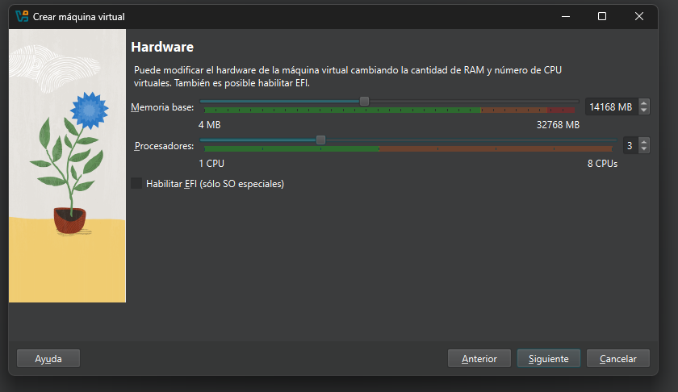

<em>Figura 23.Interfaz grafica para definir y configurar el hardware de la VM /em>

>
> **Paso 3 --- Disco duro virtual:** Se elige si se crea un disco
> virtual nuevo, se usa uno existente, o simplemente no se agrega disco
> por ahora. Al crear uno nuevo, se define el tamaño máximo y si el
> disco será de tamaño fijo o de reservar el tamaño completo.
>

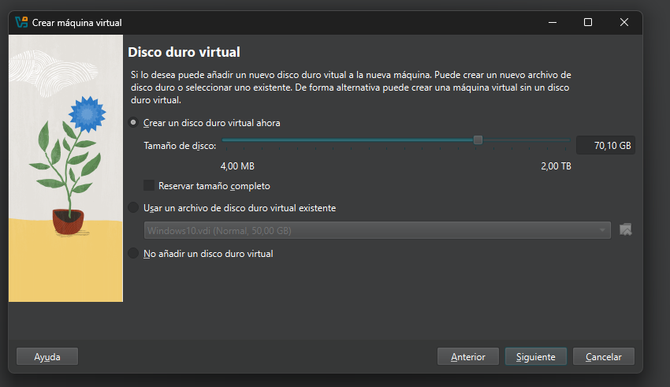

<em>Figura 24.Interfaz grafica para configurar el tipo de disco duro virtual de la VM /em>

>
> **Paso 4 --- Resumen:** Antes de finalizar, el asistente muestra un
> resumen completo de toda la configuración definida. Aquí se puede
> revisar que todo esté correcto antes de hacer clic en **Terminar**
> para crear la VM.
>

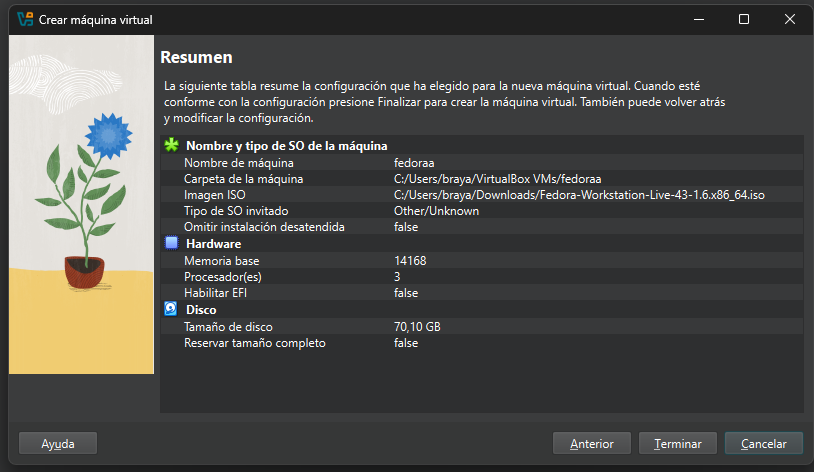

<em>Figura 25.Interfaz grafica donde se evidencia el resumen para la creación de la VM /em>

>
> **Modo experto**
>
> El modo experto concentra toda la configuración en una sola pantalla,
> sin divisiones por pasos. Esto permite configurar nombre, sistema
> operativo, RAM, CPU y disco simultáneamente, lo que resulta mucho más
> ágil para usuarios que ya conocen bien los parámetros que necesitan.
> No ofrece parámetros adicionales respecto al modo guiado, simplemente
> reorganiza la interfaz para mayor eficiencia.
>
> 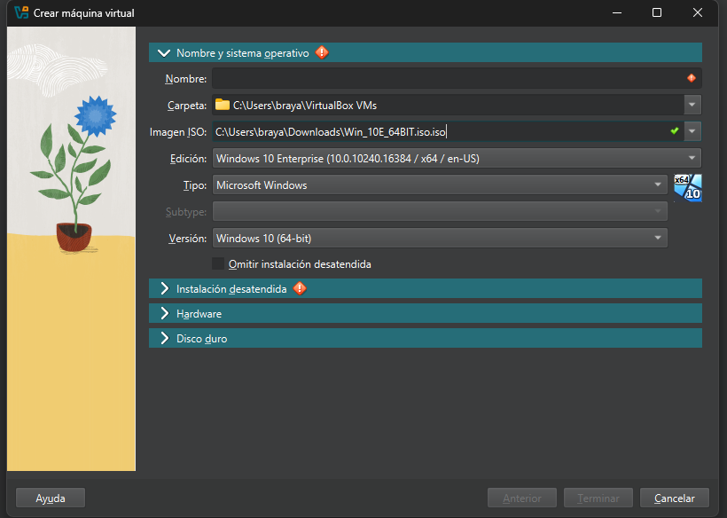{width="2.7657316272965877in"
> height="1.9548950131233596in"}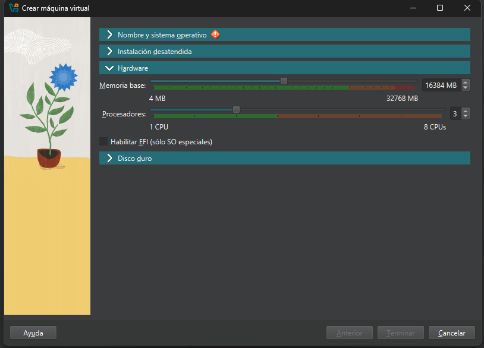{width="2.7681332020997376in"
> height="1.9757283464566928in"}

<em>Figura 26.Interfaz grafica creación de la VM en modo experto /em>

**Resultado: la VM creada**

Al finalizar el asistente, la nueva máquina virtual aparece listada en
el panel izquierdo del VirtualBox Manager con todos sus parámetros
visibles en el panel derecho.

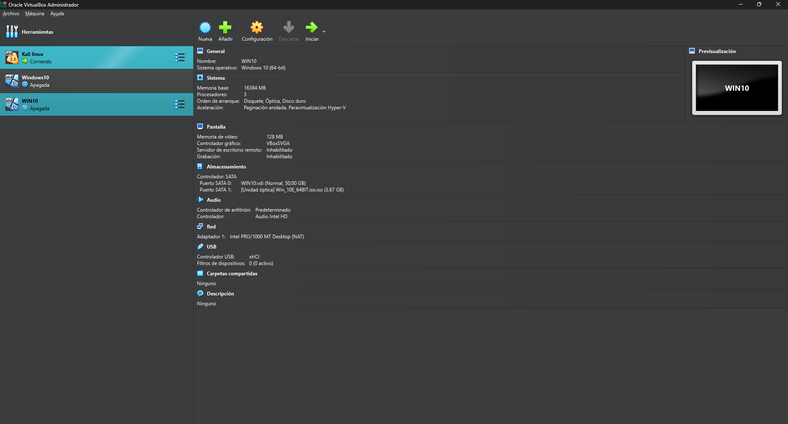

<em>Figura 27.Interfaz grafica evidencia de las diferentes VM creadas /em>

## **5. Comparación con otras soluciones de virtualización**

### **5.1 VirtualBox vs VMware Workstation**

VirtualBox y VMware Workstation son las dos soluciones de virtualización
de escritorio más utilizadas en el mundo, y su comparación es relevante
porque ambas apuntan a un perfil de usuario similar: desarrolladores,
administradores de sistemas y estudiantes que necesitan ejecutar
máquinas virtuales sobre un sistema operativo anfitrión existente. Sin
embargo, difieren considerablemente en aspectos clave como el
rendimiento, el costo, la compatibilidad y el enfoque de uso.

<em>Tabla1. Comparacion entre VirtualBox vs VMware Workstation/em>

  
| Aspecto | Descripción |
|----------|-------------|
| **Licenciamiento y costo** | Este es quizás el punto de diferencia más inmediato entre ambas herramientas. VirtualBox es una herramienta de código abierto bajo licencia GNU GPL v3, lo que permite utilizarla tanto en entornos personales como comerciales sin costo alguno. VMware Workstation Pro, por su parte, pasó por un cambio de modelo de licenciamiento importante: luego de que Broadcom adquiriera VMware, VMware Workstation Pro pasó a ser gratuito para uso personal. Sin embargo, para uso comercial se exige el pago de una suscripción anual aproximada de 120 dólares. En contraste, VirtualBox no tiene esta distinción y puede usarse libremente en cualquier contexto sin costo adicional, aunque su Extension Pack sí requiere licencia comercial para uso empresarial. |
| **Rendimiento** | VMware Workstation Pro ofrece un rendimiento superior al de VirtualBox en la ejecución de máquinas virtuales, especialmente en cargas de trabajo más exigentes. Esto se refleja en la respuesta de las VMs, el manejo de operaciones de entrada/salida y el soporte gráfico: VMware permite asignar hasta 1 GB de RAM de video a una VM, mientras que VirtualBox limita esta asignación a 128 MB. Para tareas ligeras o entornos de desarrollo y pruebas básicas, ambas herramientas funcionan de manera similar, pero cuando se requieren cargas de trabajo más intensivas, VMware tiene una ventaja notable. |
| **Compatibilidad de plataformas host** | VirtualBox puede instalarse en Windows, macOS, Linux y Solaris como sistemas anfitriones. VMware Workstation, en cambio, solo está disponible para Windows y Linux; para usuarios de macOS existe una versión separada llamada VMware Fusion. Esto representa una ventaja para VirtualBox en términos de portabilidad, ya que un usuario puede trabajar con la misma herramienta independientemente de su sistema operativo. |
| **Facilidad de uso** | VirtualBox es considerablemente más simple de instalar y configurar que VMware Workstation Pro. Su interfaz es más intuitiva y el proceso de descarga no requiere crear cuentas ni aceptar múltiples acuerdos previos. VMware, aunque tiene una interfaz gráfica bien desarrollada, presenta una curva de entrada un poco más pronunciada, especialmente en la configuración de redes avanzadas y en el proceso de instalación inicial. |
| **Formatos de disco virtual** | VirtualBox soporta tres formatos de disco virtual: VDI (nativo), VHD (compatible con Microsoft) y VMDK (compatible con VMware), lo que le da mayor flexibilidad para importar y exportar máquinas virtuales entre plataformas. VMware Workstation trabaja principalmente con el formato VMDK, aunque también puede leer otros formatos mediante conversión. |
| **Virtualización por software** | Un aspecto en el que VirtualBox tiene una ventaja única es que soporta virtualización por software, lo que permite ejecutar VMs incluso en equipos cuyo procesador no tenga soporte para Intel VT-x o AMD-V. VMware Workstation requiere obligatoriamente que el hardware tenga estas extensiones habilitadas, lo que puede ser una limitación en equipos más antiguos. |

La elección entre VirtualBox y VMware Workstation depende directamente
del contexto de uso. VirtualBox es la opción ideal para entornos
educativos, desarrollo personal y cualquier escenario donde el costo sea
un factor determinante, gracias a su naturaleza gratuita y de código
abierto. VMware Workstation, por su parte, es más adecuado para entornos
profesionales o empresariales donde el rendimiento y la integración con
otros productos del ecosistema VMware son prioritarios.

### **5.2 VirtualBox vs Hyper-V (Microsoft)**

Esta comparación es clave porque, a diferencia de VMware, Hyper-V no es
un programa que se descarga e instala como aplicación independiente,
sino una característica integrada directamente en Windows. Esto cambia
un poco los términos de la comparación, ya que ambas soluciones tienen
naturalezas arquitectónicas fundamentalmente distintas.

> **Tipo de hipervisor: la diferencia más importante**
>
> Hyper-V es un hipervisor de tipo 1, también conocido como bare-metal,
> lo que significa que se ejecuta directamente sobre el hardware del
> equipo. Cuando el sistema arranca, Hyper-V toma el control desde la
> BIOS o UEFI antes que el propio sistema operativo. VirtualBox, en
> cambio, es un hipervisor de tipo 2, lo que significa que funciona como
> una aplicación que corre sobre el sistema operativo ya instalado en el
> host. Esta distinción tiene consecuencias directas en el rendimiento:
> al estar más cerca del hardware, Hyper-V puede gestionar los recursos
> de forma más eficiente, especialmente en cargas de trabajo exigentes.
>
> Otra comparación clave de esta diferencia es el comportamiento en el
> tiempo: Hyper-V se encuentra siempre activo mientras el equipo está
> encendido, mientras que VirtualBox puede ser iniciado y cerrado por el
> usuario en el momento que lo necesite.
>
> **Disponibilidad y costo**
>
> Hyper-V está integrado como característica del sistema operativo en
> las versiones Pro, Enterprise y Education de Windows 10 y Windows 11,
> por lo que si el usuario ya cuenta con alguna de estas versiones, ya
> dispone de Hyper-V sin necesidad de instalar nada
> adicional.VirtualBox, por su parte, es gratuito y de código abierto,
> pero sí requiere descarga e instalación manual. En la versión Home de
> Windows, sin embargo, Hyper-V no está disponible, lo que convierte a
> VirtualBox en la única opción integrada para ese segmento de usuarios
> como se había hablado en comparaciones anteriores.\
> **Compatibilidad de plataformas**
>
> Este es uno de los puntos donde VirtualBox tiene una ventaja clara.
> Hyper-V únicamente puede funcionar como hipervisor en sistemas de la
> familia Windows o en el servidor dedicado Hyper-V Server. VirtualBox,
> en contraste, puede instalarse en Windows, macOS, Linux y Solaris, lo
> que lo hace ideal para entornos multiplataforma.
>
> **Rendimiento**
>
> Al ser un hipervisor de tipo 1, Hyper-V ofrece un rendimiento superior
> en entornos empresariales con cargas de trabajo intensivas, ya que
> accede directamente al hardware sin la capa intermedia del sistema
> operativo host. VirtualBox, al operar sobre el sistema operativo
> existente, introduce una mayor sobrecarga, aunque sigue siendo una
> excelente opción para escenarios de desarrollo y uso a pequeña escala.
>
> **Virtualización por software**
>
> Un aspecto donde VirtualBox tiene ventaja sobre Hyper-V es en la
> compatibilidad con hardware más antiguo. VirtualBox soporta tanto
> virtualización por hardware como por software, permitiéndole funcionar
> incluso en equipos que no tienen soporte para Intel VT-x o AMD-V,
> aunque en ese caso la virtualización por software queda limitada a
> sistemas operativos guest de 32 bits.Hyper-V requiere obligatoriamente
> las extensiones de virtualización por hardware.
>
> **Seguridad**
>
> Hyper-V cuenta con características de seguridad avanzadas orientadas a
> entornos empresariales, como las \"Shielded VMs\" (máquinas virtuales
> blindadas), que ofrecen protección adicional frente a accesos no
> autorizados. VirtualBox ofrece funciones de seguridad básicas y
> depende de las actualizaciones de la comunidad para mantenerse al día.
>
> **Conflicto entre ambas herramientas**
>
> Un punto práctico importante es que si VirtualBox se instala en un
> equipo con Windows que tiene Hyper-V activo, pueden generarse
> conflictos que afecten el funcionamiento de las máquinas virtuales,
> por lo que se recomienda desactivar Hyper-V si se va a usar VirtualBox
> como herramienta principal.

Hyper-V es la opción más adecuada para entornos empresariales Windows
donde el rendimiento y la seguridad son prioritarios, y donde ya se
cuenta con las licencias necesarias. VirtualBox, por su parte, resulta
más conveniente para usuarios que trabajan en sistemas operativos
distintos a Windows, que necesitan mayor compatibilidad con sistemas
guest variados, o que simplemente buscan una solución gratuita, portable
y fácil de usar sin depender del ecosistema Microsoft.

### **5.3 VirtualBox vs KVM/QEMU**

Esta comparación se necesita entender de la siguiente manera: KVM y QEMU
son dos herramientas distintas que generalmente se usan en conjunto, por
lo que es necesario entender qué es cada una antes de compararlas con
VirtualBox.

> **¿Qué es KVM/QEMU?**
>
> KVM (Kernel-based Virtual Machine) es el hipervisor integrado
> directamente en el kernel de Linux desde la versión 2.6.20, y
> aprovecha las extensiones de virtualización por hardware para ofrecer
> un rendimiento cercano al nativo en las máquinas virtuales. QEMU
> (Quick Emulator), por su parte, proporciona el componente de espacio
> de usuario para gestionar las VMs, incluyendo la emulación de
> dispositivos y de CPU. Cuando ambos se usan juntos, QEMU se encarga de
> la interfaz y la emulación de hardware, mientras KVM proporciona la
> aceleración directa sobre el hardware del host. Herramientas como
> **virt-manager** o **Cockpit** se utilizan habitualmente como interfaz
> gráfica para gestionar esta combinación.
>
> **Tipo de hipervisor**
>
> Tanto QEMU como VirtualBox son en principio hipervisores de tipo 2, ya
> que se instalan sobre un sistema operativo existente. Sin embargo,
> cuando QEMU se combina con KVM, la dupla pasa a funcionar como un
> hipervisor de tipo 1, accediendo directamente al hardware del host de
> forma similar a como lo hace Hyper-V.VirtualBox, en cambio, siempre
> opera como hipervisor de tipo 2, lo que introduce una mayor capa de
> abstracción entre las VMs y el hardware.
>
> **Rendimiento**
>
> Desde la perspectiva del rendimiento, QEMU/KVM es más rápido que
> VirtualBox al aprovechar la virtualización asistida por hardware
> directamente desde el kernel de Linux. Para usuarios domésticos la
> diferencia puede no ser muy perceptible, pero para cargas de trabajo
> más exigentes la ventaja de QEMU/KVM es notable.En cuanto a los
> tiempos de arranque, VirtualBox ofrece tiempos de inicio
> razonablemente rápidos, mientras que QEMU puede presentar tiempos de
> arranque más lentos dependiendo de su configuración.
>
> **Facilidad de uso**
>
> Este es uno de los puntos donde VirtualBox tiene una ventaja clara y
> contundente. VirtualBox destaca por su facilidad de uso: puede
> instalarse con un solo paquete y en pocos minutos permite tener una
> máquina virtual en funcionamiento, incluso para usuarios sin
> experiencia previa en virtualización.QEMU/KVM, en cambio, implica un
> proceso de configuración más complejo: después de instalar QEMU/KVM es
> necesario verificar que el demonio libvirtd esté en ejecución, luego
> lanzar una herramienta gráfica como virt-manager y configurar la nueva
> máquina con una imagen ISO antes de que el hipervisor finalice la
> instalación. Esto lo hace menos accesible para usuarios que se inician
> en la virtualización.
>
> **Compatibilidad de plataformas host**
>
> VirtualBox puede instalarse y funcionar correctamente en Windows,
> macOS y la mayoría de distribuciones Linux, lo que lo convierte en la
> mejor opción cuando se necesita portar máquinas virtuales entre
> distintos sistemas operativos. QEMU también puede ejecutarse en
> Windows y macOS, pero su integración directa con KVM lo hace
> especialmente adecuado para Linux.
>
> **Emulación vs virtualización**
>
> Una diferencia fundamental entre ambas soluciones es que QEMU no es
> únicamente un hipervisor sino también un emulador, lo que le permite
> ejecutar software de arquitecturas de CPU distintas a la del host,
> incluyendo x86, ARM, Alpha y SPARC. Esto lo convierte en la opción
> superior para dispositivos IoT o plataformas como Raspberry Pi.
> VirtualBox, en contraste, únicamente funciona como hipervisor y solo
> opera sobre arquitecturas x86_64.

La elección entre KVM/QEMU y VirtualBox depende en gran medida del
perfil del usuario y del entorno de trabajo. KVM/QEMU es la opción ideal
para usuarios avanzados en Linux que necesitan el máximo rendimiento y
escalabilidad, especialmente en entornos de producción o servidores.
VirtualBox, por su parte, es la herramienta preferida para
desarrolladores individuales, equipos pequeños y entornos educativos
donde la facilidad de uso, la compatibilidad multiplataforma y la curva
de aprendizaje baja son factores determinantes.

### **5.4 Tabla comparativa (resumen)**

A continuación se presenta una tabla que resume los principales
criterios de comparación entre las cuatro soluciones de virtualización
analizadas a lo largo de esta sección. El objetivo es ofrecer una visión
rápida y clara que permita identificar cuál herramienta se adapta mejor
a cada contexto de uso.

La siguiente tabla resume los principales criterios de comparación entre
Oracle VirtualBox, VMware Workstation, Hyper-V y KVM/QEMU. Las celdas
resaltadas en verde corresponden a las ventajas destacadas de
VirtualBox.

<em>Tabla 2. Resumen comparacion entre diferentes soluciónes de virtualización/em>

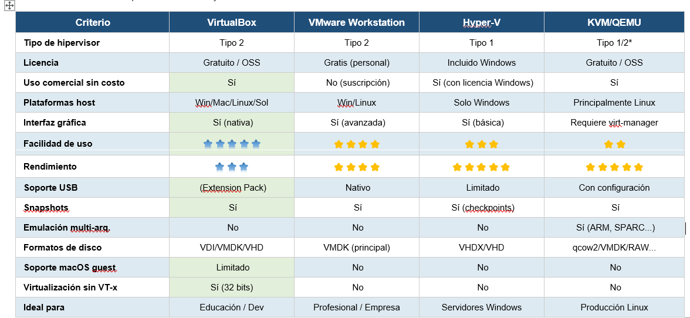

Entre los aspectos más relevantes que se desprenden de la tabla, destaca
que VirtualBox es la única solución que combina gratuidad total,
compatibilidad multiplataforma, facilidad de uso y soporte para
virtualización sin extensiones de hardware. VMware Workstation sobresale
en el ámbito profesional por su rendimiento y madurez, Hyper-V es la
opción más sólida en entornos corporativos Windows, y KVM/QEMU lidera en
rendimiento y flexibilidad dentro del ecosistema Linux, especialmente
para usuarios avanzados.

## **6. Comparación con otras soluciones de virtualización**

### **6.1 ¿Qué es Oracle Cloud Infrastructure (OCI)?**

Oracle Cloud Infrastructure es una plataforma de computación en la nube
robusta y en constante evolución, diseñada para satisfacer las demandas
de cargas de trabajo empresariales. Fue lanzada oficialmente en 2016,
inicialmente bajo el nombre de \"Oracle Bare Metal Cloud Services\",
antes de adoptar su nombre actual en 2018.Desde entonces ha
experimentado una expansión continua en servicios y presencia global,
consolidándose como una de las principales alternativas frente a
proveedores como AWS, Microsoft Azure y Google Cloud.

> **Definición y propósito**
>
> OCI es un conjunto de servicios en la nube complementarios que
> permiten compilar y ejecutar una amplia gama de aplicaciones y
> servicios en un entorno alojado de alta disponibilidad. Su propósito
> central es ofrecer a las organizaciones una infraestructura flexible,
> segura y escalable que pueda adaptarse tanto a cargas de trabajo
> simples como a sistemas empresariales de gran envergadura, sin
> sacrificar rendimiento ni previsibilidad en costos.
>
> **Principales servicios**
>
> OCI ofrece un conjunto de más de 150 servicios en la nube disponibles
> en cada región, que abarcan desde contenedores y virtualización con
> VMware hasta inteligencia artificial, permitiendo migrar, modernizar,
> crear y ampliar cualquier infraestructura de TI. Estos servicios se
> agrupan en las siguientes categorías principales:
>
> **Cómputo:** OCI ofrece recursos de cómputo de alto rendimiento
> adaptados a distintos tipos de cargas de trabajo, desde máquinas
> virtuales estándar hasta instancias bare metal, pasando por opciones
> optimizadas para procesadores AMD, Intel y Arm.
>
> **Almacenamiento:** Oracle proporciona soluciones escalables y
> resilientes que incluyen almacenamiento de bloques, archivos y
> objetos.
>
> **Bases de datos:** Siendo Oracle una empresa con raíces históricas en
> el mundo de las bases de datos relacionales, OCI ofrece servicios de
> base de datos autónomos que combinan automatización, inteligencia e
> integración multicloud.
>
> **Inteligencia Artificial:** Oracle Cloud ha expandido su actuación en
> inteligencia artificial, ofreciendo recursos de IA generativa, modelos
> preconstruidos e infraestructura de alto rendimiento con GPUs, ideales
> para empresas que desean innovar con automatización y análisis de
> datos.
>
> **Seguridad:** La seguridad es un pilar fundamental de OCI, con un
> diseño que incorpora funciones avanzadas como IAM, grupos de seguridad
> de red, WAF, protección contra DDoS y Cloud Guard. Los datos se cifran
> de forma predeterminada tanto en reposo como en tránsito, y OCI cumple
> con numerosos estándares de cumplimiento globales, lo que lo hace
> ideal para sectores altamente regulados.
>
> **Nivel gratuito**
>
> Para facilitar la adopción por parte de nuevos usuarios, Oracle ofrece
> un nivel gratuito sin límite de tiempo para más de 20 servicios, como
> Autonomous AI Database, Arm Compute y Storage, así como 300 dólares en
> créditos gratuitos para probar otros servicios en la nube.Esto resulta
> bueno en el contexto de VirtualBox, ya que permite a los usuarios
> experimentar con la integración entre sus máquinas virtuales locales y
> la infraestructura de OCI sin incurrir en costos iniciales.

### **6.2 Integración de VirtualBox con Oracle Cloud Infrastructure**

La integración entre VirtualBox y OCI representa uno de los
diferenciadores más relevantes de VirtualBox frente a otras soluciones
de virtualización de escritorio, ya que permite al usuario tender un
puente directo entre su entorno local y la nube de Oracle. VirtualBox 7
permite a las organizaciones gestionar de forma centralizada sus
máquinas virtuales de desarrollo y producción tanto en entornos locales
como en instancias de OCI, usando cualquier sistema operativo que
soporte VirtualBox, como Windows, Linux o macOS.

> **Requisito previo: Extension Pack**
>
> Para acceder a la integración con OCI es necesario tener instalado el
> VirtualBox Extension Pack, disponible de forma gratuita para uso
> personal y educativo bajo la licencia PUEL. Para uso comercial se
> requiere adquirir una licencia comercial. Una vez instalado, el
> VirtualBox Manager muestra un nuevo grupo llamado **OCI** en el panel
> de máquinas, desde donde se gestionan todas las operaciones con la
> nube.
>
> **Cloud Profile**
>
> El elemento central que hace posible la integración es el **Cloud
> Profile** o perfil de nube. El perfil de nube identifica al usuario y
> al compartimento dentro de OCI, e incluye los detalles del par de
> claves utilizado para conectarse a las instancias. Todos los perfiles
> registrados en VirtualBox se listan automáticamente en el grupo OCI
> del VirtualBox Manager.
>
> **Exportar una VM local hacia OCI**
>
> Una de las funcionalidades más valiosas de esta integración es la
> posibilidad de tomar una máquina virtual creada y configurada
> localmente en VirtualBox y desplegarla directamente en la nube de
> Oracle. Con un solo botón o comando es posible exportar una VM desde
> un dispositivo local y ejecutarla en OCI.
>
> El proceso consiste en seleccionar la VM deseada, ir a la opción
> *Exportar dispositivo*, elegir **Oracle Cloud Infrastructure** como
> formato de destino y configurar los parámetros de la instancia en OCI,
> como la forma de cómputo (*shape*), el número de OCPUs, la red virtual
> y la subred. Al hacer clic en Exportar, la VM se sube a OCI y se crean
> instancias para las VMs cargadas. Por defecto, la instancia se inicia
> automáticamente tras la carga.
>
> **Importar una instancia de OCI hacia VirtualBox**
>
> El proceso inverso también es posible. VirtualBox permite importar
> instancias existentes de OCI directamente al VirtualBox Manager para
> utilizarlas de forma local. Esto resulta especialmente útil cuando se
> desea trabajar sin conexión a internet o realizar pruebas locales
> sobre una instancia que normalmente corre en la nube.
>
> **Consideraciones técnicas para la exportación**
>
> Antes de exportar una VM a OCI, es necesario preparar la imagen para
> garantizar que arranque correctamente en la infraestructura de la
> nube. Se recomienda usar DHCP en lugar de IP estática en la
> configuración de red de la VM, ya que esto permite que OCI asigne
> dinámicamente la dirección IP al iniciar la instancia.Adicionalmente,
> es necesario limpiar cualquier configuración de red persistente para
> que la VM no intente conservar las interfaces de red que tenía
> disponibles en VirtualBox.
>
> En cuanto al modo de lanzamiento, si la VM fue preparada con soporte
> para controladores paravirtualizados (virtio), se recomienda
> seleccionar el modo paravirtualizado al importar la imagen en OCI, ya
> que ofrece el mejor rendimiento posible.
>
> **Impacto práctico**
>
> Esta integración vuelve a VirtualBox de una herramienta que es local
> en un puente hacia la nube empresarial de Oracle, lo que resulta se
> puede decir valioso en escenarios de desarrollo donde un equipo
> trabaja localmente durante la fase de pruebas y luego despliega
> directamente en producción sobre OCI sin necesidad de reconfigurar ni
> migrar manualmente la infraestructura.

### **6.3 OCI Compute**

OCI Compute es el servicio central de cómputo dentro de Oracle Cloud
Infrastructure y el componente directamente involucrado cuando se
exporta o despliega una máquina virtual desde VirtualBox hacia la nube.
Entender su funcionamiento es importante para comprender qué ocurre con
una VM local una vez que llega a OCI.

> **¿Qué es OCI Compute?**
>
> OCI Compute es el servicio que permite aprovisionar y gestionar hosts
> de cómputo en la nube de Oracle. Una instancia de cómputo es
> esencialmente una máquina Linux o Windows creada en la nube con una
> forma (*shape*) determinada, que incluye OCPUs, memoria,
> almacenamiento y un volumen de arranque, y sobre la cual se pueden
> desplegar distintos servicios según los requisitos de la aplicación.
>
> **El concepto de Shape**
>
> Uno de los conceptos más importantes de OCI Compute es el **shape** o
> forma. Un shape es una plantilla que determina el tipo y la cantidad
> de recursos asignados a una instancia de cómputo, incluyendo
> procesador, memoria y almacenamiento local. Se elige al momento de
> crear la instancia.
>
> OCI ofrece cuatro categorías principales de shapes:
>
> **Standard shapes:** Ofrecen un equilibrio entre núcleos de
> procesador, memoria y recursos de red, y están disponibles con
> procesadores Intel o AMD. Son los más utilizados para cargas de
> trabajo de propósito general. **DenseIO shapes:** Incluyen
> almacenamiento NVMe de alto rendimiento conectado localmente, ideales
> para grandes bases de datos y aplicaciones de Big Data. **GPU
> shapes:** Incorporan procesadores Intel junto con GPUs NVIDIA,
> diseñados para cargas de trabajo con aceleración por hardware. **HPC
> shapes (High Performance Computing):** Diseñados para cargas de
> trabajo masivamente paralelas que requieren núcleos de procesador de
> alta frecuencia y redes de clúster de alto rendimiento, disponibles
> únicamente en instancias bare metal.
>
> **Tipos de instancias**
>
> Más allá de los shapes, OCI Compute ofrece tres tipos de instancias
> según el nivel de acceso al hardware:
>
> Las **instancias Bare Metal** otorgan acceso directo al servidor
> físico subyacente sin capa de virtualización, proporcionando el máximo
> rendimiento y aislamiento para cargas de trabajo exigentes. Las
> **instancias de Máquina Virtual (VM)** corren sobre el hardware bare
> metal y son las más comunes para uso general. Finalmente, existe la
> opción de **Dedicated VM Hosts**, que permite ejecutar instancias de
> VM sobre un servidor físico dedicado exclusivamente a un cliente,
> garantizando aislamiento total frente a otros usuarios de la nube.
>
> **Shapes flexibles**
>
> Una de las características más relevantes de OCI Compute en la
> actualidad es el modelo de **shapes flexibles**. Un shape flexible
> permite personalizar el número de OCPUs y la cantidad de memoria al
> momento de lanzar o redimensionar una VM. Al crear una instancia con
> este tipo de shape, el usuario selecciona los recursos que necesita
> según la carga de trabajo, y el ancho de banda de red y el número de
> interfaces virtuales escalan proporcionalmente con el número de OCPUs
> asignadas. Esto resulta especialmente útil al importar una VM desde
> VirtualBox, ya que permite ajustar los recursos de la instancia en OCI
> para que se aproximen a los que tenía configurados localmente.
>
> **Unidad de medida: OCPU vs vCPU**
>
> Un aspecto que puede generar confusión al pasar de un entorno
> VirtualBox (donde se asignan vCPUs) a OCI es la diferencia entre las
> unidades de medida. OCI mide los recursos de cómputo en OCPUs (Oracle
> CPU), donde cada OCPU representa un núcleo físico de CPU. Dado que la
> mayoría de arquitecturas x86 ejecutan dos hilos por núcleo, un OCPU
> equivale a dos vCPUs en términos de capacidad de procesamiento.Esto
> significa que al exportar una VM de VirtualBox con 2 vCPUs asignadas,
> en OCI podría configurarse con 1 OCPU para una equivalencia
> aproximada.
>
> **Autoescalado**
>
> OCI Compute permite configurar autoescalado para ajustar
> automáticamente el número de instancias en un pool según métricas de
> rendimiento como la utilización de CPU. Cuando la demanda aumenta, se
> aprovisionan nuevas instancias automáticamente; cuando disminuye, se
> eliminan, optimizando tanto el rendimiento como el costo.Esta
> capacidad transforma completamente el paradigma de una VM local
> estática en VirtualBox, hacia una infraestructura elástica y adaptable
> en la nube.

## **7. Casos de uso y escenarios reales**

### **7.1 Desarrollo y pruebas de software**

> Este es el caso de uso más extendido de VirtualBox en el mundo
> profesional. Los principales usos de VirtualBox en el desarrollo de
> software incluyen la realización de pruebas en múltiples sistemas
> operativos, la creación de entornos de desarrollo aislados y la
> configuración de ambientes de prueba en modo sandbox.
>
> En la práctica, esto se traduce en escenarios muy concretos.
> VirtualBox proporciona un entorno aislado donde los desarrolladores
> pueden probar sus aplicaciones sin ningún riesgo para el sistema real
> ni para los demás programas que corren en él. También resulta útil
> para la depuración de errores, ya que permite ejecutar pruebas en un
> entorno controlado con configuraciones de hardware específicas y
> recursos limitados.
>
> Otro escenario frecuente es el de las pruebas multiplataforma.
> VirtualBox permite a los desarrolladores ejecutar varios sistemas
> operativos en una sola máquina para probar que sus aplicaciones
> funcionen correctamente en distintos entornos, como Windows, macOS y
> Linux. Esto elimina la necesidad de mantener múltiples equipos físicos
> para cubrir cada plataforma objetivo.
>
> Para equipos de DevOps y pipelines de integración y entrega continua
> (CI/CD), las VMs permiten ejecutar compilaciones paralelas o probar
> pipelines en entornos aislados sin comprometer el sistema de
> producción. GeeksforGeeks La función de snapshots juega un papel
> fundamental en este contexto, ya que permite tomar una instantánea del
> estado de la VM antes de cada prueba y revertir a ese estado limpio en
> segundos si algo falla.

### **7.2 Educación y aprendizaje**

> VirtualBox es una herramienta ampliamente adoptada en entornos
> académicos, bootcamps y procesos de autoaprendizaje, y por buenas
> razones. Las universidades y bootcamps de programación distribuyen VMs
> preconfiguradas a sus estudiantes, creando entornos uniformes que
> simplifican la configuración inicial y el soporte técnico. Estos
> laboratorios virtuales permiten a los estudiantes experimentar
> libremente y reiniciar los sistemas cuando sea necesario, sin ningún
> tipo de riesgo.
>
> Por ejemplo, los desarrolladores suelen instalar Ubuntu sobre Windows
> usando VirtualBox, lo que les permite explorar o construir en un
> entorno Linux sin necesidad de configurar un arranque dual ni
> arriesgar su sistema principal. Esta configuración es especialmente
> popular entre estudiantes y principiantes en Linux.
>
> Para el aprendizaje de ciberseguridad, el valor de VirtualBox es aún
> más evidente. Los profesionales y estudiantes de seguridad utilizan
> VMs para configurar laboratorios de pruebas de penetración con
> distribuciones como Kali Linux y Metasploit, así como para trabajar
> con máquinas vulnerables intencionalmente configuradas para practicar
> técnicas de ataque y defensa. Todo esto en un entorno completamente
> aislado del sistema anfitrión, sin ningún riesgo para el equipo real.

### **7.3 Soporte técnico y recuperación**

> VirtualBox también tiene aplicaciones prácticas en el ámbito del
> soporte técnico y la recuperación de sistemas. Un técnico puede
> mantener una biblioteca de VMs preconfiguradas con distintos sistemas
> operativos y versiones de software, lo que le permite reproducir
> exactamente el entorno de un cliente para diagnosticar y resolver
> problemas sin necesidad de acceder físicamente al equipo afectado.
>
> VirtualBox permite simular el comportamiento de la red y solucionar
> problemas relacionados con protocolos de red. Tareas como pruebas de
> TCP/IP y UDP que normalmente requerirían una infraestructura física
> pueden realizarse directamente desde una VM. Esto reduce
> considerablemente el tiempo y los recursos necesarios para
> diagnosticar fallos de conectividad o configuración.
>
> Adicionalmente, la capacidad de exportar e importar máquinas virtuales
> facilita la recuperación ante desastres: una VM respaldada puede
> restaurarse en cualquier equipo compatible con VirtualBox en cuestión
> de minutos, sin depender de hardware específico ni de procesos de
> reinstalación complejos.

### **7.4 Aplicaciones legadas**

> Uno de los escenarios más frecuentes en entornos empresariales es la
> necesidad de mantener en funcionamiento software antiguo que no es
> compatible con los sistemas operativos modernos. En el ámbito
> empresarial, las VMs se utilizan habitualmente para ejecutar software
> legado de Windows en sistemas macOS modernos, ayudando a las empresas
> a conservar sus aplicaciones antiguas sin necesidad de reemplazar el
> hardware.
>
> Es posible usar VirtualBox para tareas como ejecutar un programa
> antiguo que no es compatible con el sistema operativo actual, sin
> arriesgar el entorno principal de trabajo.Por ejemplo, una empresa
> puede tener un sistema de gestión interno desarrollado para Windows XP
> que sigue siendo crítico para sus operaciones, pero que no puede
> ejecutarse en Windows 11. VirtualBox permite mantener una VM con
> Windows XP funcionando dentro del sistema moderno, resolviendo el
> problema sin inversión adicional en hardware.
>
> VirtualBox es la herramienta perfecta para la validación de software
> legado, ya que permite simular un laboratorio completo con múltiples
> sistemas operativos antiguos en un solo equipo.

### **7.5 Migración a la nube**

> El último caso de uso conecta directamente con lo visto en el apartado
> 6 sobre la integración con OCI. VirtualBox se ha convertido en una
> herramienta estratégica para facilitar el proceso de migración desde
> infraestructuras locales hacia la nube, particularmente hacia Oracle
> Cloud Infrastructure.
>
> El flujo típico en este escenario consiste en que un equipo de
> desarrollo construye y valida su entorno de trabajo completamente en
> VirtualBox, sobre su propio hardware. Una vez que el entorno está
> estable y probado, la VM se exporta directamente a OCI utilizando la
> integración nativa de VirtualBox, donde pasa a ejecutarse como una
> instancia de cómputo en la nube. Este proceso elimina la necesidad de
> reconfigurar el entorno desde cero en la nube, reduciendo
> significativamente el tiempo y el riesgo asociados a la migración.
>
> La portabilidad de VirtualBox, que soporta los formatos VDI, VMDK y
> VHD, facilita también la migración hacia otras plataformas de nube o
> hacia otras soluciones de virtualización, ya que los discos virtuales
> pueden convertirse y reutilizarse sin necesidad de reinstalar el
> sistema operativo invitado. Pureinfotech
>
> Este escenario es especialmente bueno para pequeñas y medianas
> empresas que desean modernizar su infraestructura gradualmente,
> comenzando con un entorno virtual local y escalando hacia la nube
> conforme crecen sus necesidades, sin grandes inversiones iniciales ni
> interrupciones en sus operaciones.

**Referencias**

¿Cuál elegir para su infraestructura? Hyper-V o VirtualBox. (2022,
diciembre 1). NAKIVO.
[[https://www.nakivo.com/es/blog/hyper-v-virtualbox-one-choose-infrastructure/]{.underline}](https://www.nakivo.com/es/blog/hyper-v-virtualbox-one-choose-infrastructure/)

Hixec. (2025, octubre 29). VirtualBox: qué es, para qué sirve y cómo
operarlo con criterio técnico.
[[https://hixec.com/blog/virtualbox-que-es-para-que-sirve-y-como-operarlo-con-criterio-tecnico/]{.underline}](https://hixec.com/blog/virtualbox-que-es-para-que-sirve-y-como-operarlo-con-criterio-tecnico/)

Installing VirtualBox. (s/f). August 2025. Recuperado el 20 de febrero
de 2026, de
[[https://www.virtualbox.org/manual/topics/installation.html]{.underline}](https://www.virtualbox.org/manual/topics/installation.html)

Integrating with Oracle Cloud Infrastructure. (2026). Virtualbox.org.
[[https://www.virtualbox.org/manual/topics/cloud-integration.html#cloud-integration]{.underline}](https://www.virtualbox.org/manual/topics/cloud-integration.html#cloud-integration)

Maldonado, R. (2025, 2 abril). 10 componentes del Virtual Box \[2026\]
\| KeepCoding Bootcamps. KeepCoding Bootcamps.
[[https://keepcoding.io/blog/componentes-del-virtual-box/]{.underline}](https://keepcoding.io/blog/componentes-del-virtual-box/)

Montini, H., Pompeu, L., & Glushko, B. (2023, mayo 22). Qué es
VirtualBox: casos de uso y beneficios. SalvageData.
[[https://www.salvagedata.com/blog/what-is-virtualbox]{.underline}](https://www.salvagedata.com/blog/what-is-virtualbox)

Oracle® VM VirtualBox Administrator\'s Guide for Release 6.1. (2021,
January 20). Oracle Help Center.
[[https://docs.oracle.com/en/virtualization/virtualbox/6.1/admin/#Administrator]{.underline}](https://docs.oracle.com/en/virtualization/virtualbox/6.1/admin/#Administrator)

Oracle VM VirtualBox: User Manual for Release 6.1. (s/f). Oracle Help
Center.
[[https://docs.oracle.com/en/virtualization/virtualbox/6.1/user/]{.underline}](https://docs.oracle.com/en/virtualization/virtualbox/6.1/user/)

Oracle VM VirtualBox Overview. (s/f). Recuperado el 22 de febrero de
2026, de
[[https://www.oracle.com/latam/a/ocom/docs/dc/em/oracle-vm-virtualbox-overview-2981353.pdf]{.underline}](https://www.oracle.com/latam/a/ocom/docs/dc/em/oracle-vm-virtualbox-overview-2981353.pdf)

Oracle® VM VirtualBox®.
(s/f).[[https://www.virtualbox.org/manual/UserManual.html]{.underline}](https://www.virtualbox.org/manual/UserManual.html)

Pure Storage. (2025, February 8). KVM vs. VirtualBox: Which One Should
You Use? Pure Storage Blog.
[[https://blog.purestorage.com/purely-technical/kvm-vs-virtualbox-which-one-should-you-use/]{.underline}](https://blog.purestorage.com/purely-technical/kvm-vs-virtualbox-which-one-should-you-use/)

VirtualBox vs VMware vs Hyper-V - Diferencias y mejor programa. (s/f).
SoftZone.
[[https://www.softzone.es/programas/utilidades/diferencias-vmware-virtualbox-hyper-v/]{.underline}](https://www.softzone.es/programas/utilidades/diferencias-vmware-virtualbox-hyper-v/)
